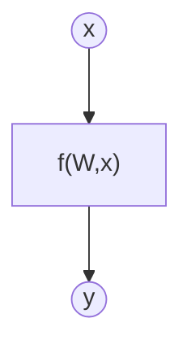
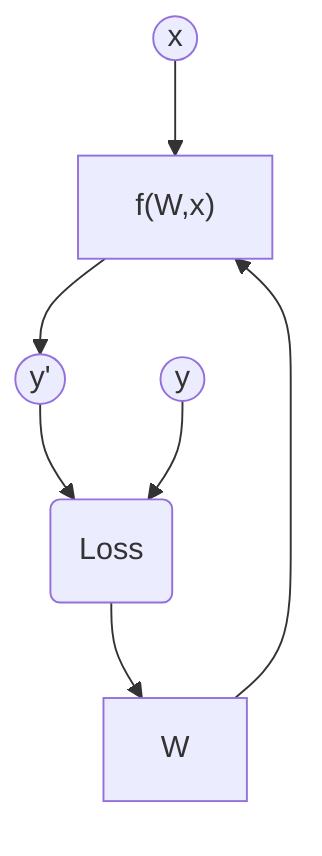

# Ejercicio 1: Aprende una función lineal con PyTorch

## Objetivo

El objetivo de este ejercicio es modelar una función desconocida mediante un método de aprendizaje automático.

*Nota del profesor: La función que intentamos modelar es la función lineal y = 5x + 2. El propósito del ejercicio no es descubrir la función analítica, sino crear un modelo que mejor imite el comportamiento de esa función, aunque sea una caja negra para el usuario.*

## Formalización de tareas

La tarea que se puede formalizar en dos pasos. Primero, definiremos lo que intentamos lograr de la forma más clara posible. En segundo lugar, definiremos el enfoque que estamos adoptando para resolverlo.

### Lo que intentamos hacer (Inferencia)

Existe una función desconocida $f$ para lo cual disponemos de un montón de datos sobre ciertas entradas $x$ y su salida correspondiente $y$.

$$
y = f(x)
$$

Estamos intentando crear un modelo de $f$ usando un método de aprendizaje automático para inferir la matriz de pesos de $W$ que exprese mejor la relación entre $x$-$y$ de datos. Expresado matemáticamente:

$$
y = f(W,x)
$$

Expresado gráficamente:

El vector de entrada tiene tamaño [bs x 1]. La matriz de pesos tiene un tamaño [1 x 1]

### Cómo lo vamos a hacer (entrenamiento)

*Tarea para el estudiante: Explica qué intenta representar el siguiente diagrama. Corregid cualquier cosa si se puede expresar mejor. Puedes añadir tu propia imagen (dibujada a mano o de otro tipo) si no te gusta usar mermaid. Mientras seas capaz de demostrarnos que entiendes lo que haces gráficamente, estará bien.*

## Métricas de evaluación

Como estamos tratando con un problema de regresión, utilizaremos el error cuadrático medio (MSE), el error absoluto medio (MAE) y el R-cuadrado como métricas de evaluación.

## Consideraciones de datos

### Descripción del conjunto de datos

El conjunto de datos contiene 100 puntos de datos ruidosos con una desviación estándar de ruido de 20 respecto a la función real (y = 5x + 2).

### Preparación y preprocesamiento de datos

No se ha realizado ningún preprocesado. El conjunto de datos se ha dividido en conjuntos de entrenamiento, validación y prueba.

### Aumento de datos

No se ha realizado ninguna ampliación de datos.

## Consideraciones del modelo/modelado

### Función de pérdida seleccionada

Como es una tarea de regresión, se utiliza la función MSE.

*Tarea para el estudiante: Explica por qué se eligió la función de pérdida. ¿Hay otra alternativa?

### Posibles arquitecturas

Se utiliza una arquitectura de perceptrón simple como base. Esta arquitectura tiene dos parámetros: $W$ y $b$, y se aprenden durante el entrenamiento.

*Tarea para el estudiante: Explica por qué se ha elegido este modelo. ¿Por qué un perceptrón simple en lugar de otras alternativas? Explica las ventajas y desventajas. ¿Se va a generalizar bien a datos no vistos? ¿Qué otra alternativa podría usarse?*

### Activación de la última capa

Como es una tarea de regresión sin límites inferiores ni superiores, la activación de la última capa se establece en función Identidad.

### Otras consideraciones

*Tarea para el alumno: Añade lo que consideres importante.*

## Entrenamiento

El entrenamiento se ha realizado a lo largo de 100 épocas. El gráfico de la función de pérdida se muestra a continuación.

### Grafo de función de pérdida

### Hiperparámetros de entrenamiento

La tasa de aprendizaje se establece en 0,0001

*Tarea para el estudiante: Hacer cambios hasta que el modelo funcione. Explica todos los cambios que has hecho en los hiperparámetros de entrenamiento y por qué.*

### Discusión sobre el proceso de entrenamiento

Podemos entender que el modelo converge y no ocurre ningún sobreajuste.

## Evaluación

### Métricas de evaluación

Como problema de regresión, utilizaremos el error cuadrático medio (MSE), el error absoluto medio (MAE) y el R-cuadrado como métricas de evaluación.

Podemos apreciar gráficos de regresión para conjuntos de entrenamiento, validación y prueba.

Las métricas de cada conjunto de datos se representan: 

### Evaluación de los resultados

Aquí tenéis ejemplos de resultados de evaluación para conjuntos de entrenamiento, validación y prueba.

Ejemplo para el conjunto de entrenamiento:

Ejemplo para el conjunto de validación:

Ejemplo para el conjunto de pruebas:

### Discusión de los resultados

*Tarea para el estudiante: ¿Hay sobreajuste, subajuste u otros problemas? ¿Cómo podemos mejorar el modelo? ¿Cómo va a generalizarse este modelo a nuevos datos?*

## Iteración del diseño

*Tarea para el estudiante: Describe el proceso que has seguido para mejorar el modelo y la evolución del rendimiento del modelo durante el proceso.*

*Puedes incluir una tabla que indique los chanched parameters y los resultados obtenidos tras el proceso.*

## Preguntas adicionales

*Tarea para el estudiante: Responder a las siguientes preguntas. Incluye gráficos si es necesario. Almacenar los gráficos en la carpeta `outs/exercise_01`.*

### ¿Qué pasa si añades más parámetros al modelo?

### ¿Qué pasa si añades más capas al modelo?

### ¿Qué ocurre si cambias la función de activación de la última capa a ReLU?

### ¿Y a Sigmoid?

### ¿Qué pasa si cambias la velocidad de aprendizaje?

### Por favor, reduce los puntos de datos del conjunto de datos a 10 y crea 2 capas / 20 neuronas cada una. En este caso, ¿cómo puedes reducir el problema de sobreajuste?