# Ejercicio 1: Aprende una función lineal con PyTorch

## Objetivo

El objetivo de este ejercicio es modelar una función desconocida mediante un método de aprendizaje automático.

*Nota del profesor: La función que intentamos modelar es la función lineal y = 5x + 2. El propósito del ejercicio no es descubrir la función analítica, sino crear un modelo que mejor imite el comportamiento de esa función, aunque sea una caja negra para el usuario.*

## Formalización de tareas

La tarea que se puede formalizar en dos pasos. Primero, definiremos lo que intentamos lograr de la forma más clara posible. En segundo lugar, definiremos el enfoque que estamos adoptando para resolverlo.

### Lo que intentamos hacer (Inferencia)

Existe una función desconocida $f$ para lo cual disponemos de un montón de datos sobre ciertas entradas $x$ y su salida correspondiente $y$.

$$
y = f(x)
$$

Estamos intentando crear un modelo de $f$ usando un método de aprendizaje automático para inferir la matriz de pesos de $W$ que exprese mejor la relación entre $x$-$y$ de datos. Expresado matemáticamente:

$$
y = f(W,x)
$$

Expresado gráficamente:

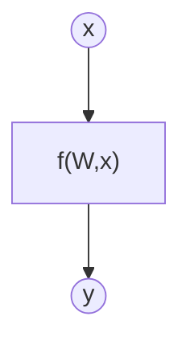

El vector de entrada tiene tamaño [bs x 1]. La matriz de pesos tiene un tamaño [1 x 1]

### Cómo lo vamos a hacer (entrenamiento)

*Tarea para el estudiante: Explica qué intenta representar el siguiente diagrama. Corregid cualquier cosa si se puede expresar mejor. Puedes añadir tu propia imagen (dibujada a mano o de otro tipo) si no te gusta usar mermaid. Mientras seas capaz de demostrarnos que entiendes lo que haces gráficamente, estará bien.*

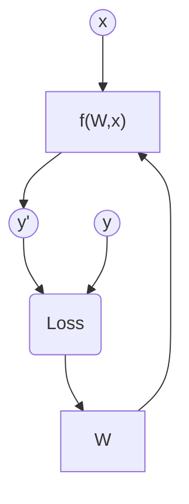

#### Explicación del diagrama de entrenamiento

El diagrama representa el proceso completo de entrenamiento de un modelo de
Machine Learning entrenado mediante la minimización de una función de pérdida.

##### Elementos del diagrama

- x: vector de entrada del modelo (datos de entrada).
- y: valor real u objetivo.
- f(W, x): modelo o función parametrizada por los pesos W, que genera
  una predicción a partir de la entrada.
- y′: salida estimada o predicción del modelo.
- Loss: función de pérdida que mide la diferencia entre la predicción
  y′ y el valor real y.
- W: conjunto de parámetros (pesos sinápticos) del modelo que se ajustan
  durante el entrenamiento.

##### Flujo del proceso de aprendizaje

1. La entrada **x** se introduce en el modelo **f(W, x)**.
2. El modelo genera una predicción **y′**.
3. La predicción **y′** se compara con el valor real **y** mediante la función
   de pérdida **Loss(y, y′)**.
4. La función de pérdida produce un valor escalar que cuantifica el error del
   modelo.
5. Este error se utiliza para actualizar los pesos **W**, generalmente mediante
   un algoritmo de optimización basado en gradiente descendente.
6. Los pesos actualizados se realimentan al modelo, cerrando el ciclo de
   entrenamiento.

Este proceso se repite de forma iterativa hasta que la función de pérdida
converge o se alcanza un criterio de parada.

##### Versión mejorada del diagrama

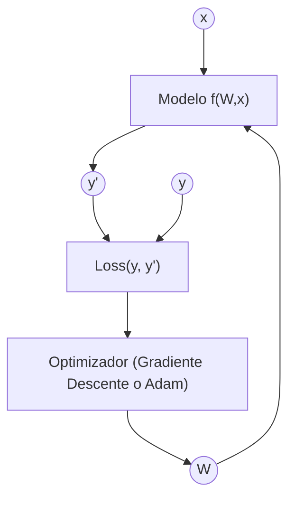

## Métricas de evaluación

Como estamos tratando con un problema de regresión, utilizaremos el error cuadrático medio (MSE), el error absoluto medio (MAE) y el R-cuadrado como métricas de evaluación.

## Consideraciones de datos

### Descripción del conjunto de datos

El conjunto de datos contiene 10000 puntos de datos ruidosos con una desviación estándar de ruido de 20 respecto a la función real (y = 5x + 2).

### Preparación y preprocesamiento de datos

No se ha realizado ningún preprocesado. El conjunto de datos se ha dividido en conjuntos de entrenamiento, validación y prueba.

### Aumento de datos

No se ha realizado ninguna ampliación de datos.

## Consideraciones del modelo/modelado

### Función de pérdida seleccionada

Como es una tarea de regresión, se utiliza la función MSE.

*Tarea para el estudiante: Explica por qué se eligió la función de pérdida. ¿Hay otra alternativa?*

En esta tarea se utiliza la función de pérdida MSE (Mean Squared Error), ya que el problema planteado es un problema de regresión no lineal, en el que la salida del modelo es una variable continua.

La función MSE mide el error medio al cuadrado entre el valor real y y la predicción del modelo y′, y se define como:

$$\text{MSE} = \frac{1}{N} \sum_{i=1}^{N} (y_i - y'_i)^2$$

El objetivo del entrenamiento es ajustar los pesos sinápticos del modelo para minimizar esta función de pérdida mediante un algoritmo de optimización basado en gradiente descendente.

#### Alternativas

La función de pérdida utilizada depende del tipo de problema:

- En regresión no lineal, se emplea el error cuadrático medio (MSE).
- En problemas de clasificación, se utiliza la entropía cruzada.

### Posibles arquitecturas

Se utiliza una arquitectura de perceptrón simple como base. Esta arquitectura tiene dos parámetros: $W$ y $b$, y se aprenden durante el entrenamiento.

*Tarea para el estudiante: Explica por qué se ha elegido este modelo. ¿Por qué un perceptrón simple en lugar de otras alternativas? Explica las ventajas y desventajas. ¿Se va a generalizar bien a datos no vistos? ¿Qué otra alternativa podría usarse?*

En esta práctica se utiliza como modelo base un perceptrón simple, que es una red neuronal artificial con una única capa y una relación lineal entre la entrada y la salida. Este modelo está parametrizado por un conjunto de pesos W y un sesgo b, que se ajustan durante el entrenamiento.

#### Justificación de la elección del perceptrón simple

Un perceptrón simple (o Adaline en problemas de regresión) es un modelo adecuado cuando se desea aprender una relación funcional sencilla entre las variables de entrada y salida.

En este caso, el problema planteado es una tarea de regresión, donde se busca aproximar una función continua a partir de datos de entrada. El perceptrón simple permite modelar relaciones lineales de forma directa y comprensible.

Además, este modelo tiene una estructura sencilla y fácil de interpretar, y permite centrarse en el proceso de entrenamiento y en la minimización de la función de pérdida sin añadir complejidad innecesaria.

#### Ventajas del perceptrón simple

- Arquitectura sencilla con pocos parámetros a optimizar.
- Entrenamiento rápido y estable.
- Fácil interpretación del efecto de los pesos sinápticos.
- Adecuado cuando la relación entre entrada y salida es simple.

#### Desventajas del perceptrón simple

- Capacidad de representación limitada.
- No puede modelar relaciones no lineales complejas.
- Su rendimiento depende de que la función a aprender pueda aproximarse correctamente con un modelo simple.

#### Generalización a datos no vistos

Dado que la relación a aprender es simple y el modelo tiene un número reducido de parámetros, el perceptrón no memoriza los datos de entrenamiento, sino que aprende una función general. Esto permite que, al introducir nuevos valores de entrada no vistos durante el entrenamiento, el modelo produzca predicciones coherentes y próximas a los valores reales.

Por tanto, se espera que el modelo generalice correctamente a datos no vistos, siempre que estos pertenezcan al mismo problema y sigan la misma relación que los datos utilizados durante el entrenamiento.

#### Alternativas posibles

Una alternativa natural al perceptrón simple es una red neuronal multicapa (MLP) con una o varias capas ocultas. Este tipo de arquitecturas permite aproximar funciones no lineales más complejas gracias a la incorporación de funciones de activación no lineales en las capas ocultas.

No obstante, para el problema planteado en esta práctica, el uso de un modelo más complejo no es necesario y podría introducir complejidad adicional sin mejorar significativamente el rendimiento.

### Activación de la última capa

Como es una tarea de regresión sin límites inferiores ni superiores, la activación de la última capa se establece en función Identidad.

### Otras consideraciones

*Tarea para el alumno: Añade lo que consideres importante.*

## Entrenamiento

El entrenamiento se ha realizado a lo largo de 100 épocas. El gráfico de la función de pérdida se muestra a continuación.

### Grafo de función de pérdida

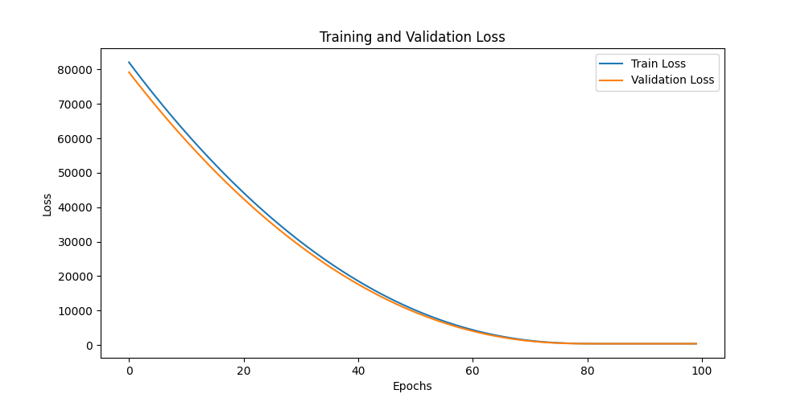

### Hiperparámetros de entrenamiento

La tasa de aprendizaje se establece en 0,0001

*Tarea para el estudiante: Hacer cambios hasta que el modelo funcione. Explica todos los cambios que has hecho en los hiperparámetros de entrenamiento y por qué.*

El modelo ya converge correctamente con la configuración base: la pérdida de entrenamiento y validación disminuyen de forma progresiva durante las épocas, y se guarda el modelo con mejor pérdida de validación. Por tanto, no ha sido necesario modificar hiperparámetros para que el entrenamiento funcione.

Los hiperparámetros utilizados son coherentes:
- Learning rate (0,0001): es el escalar que determina el tamaño del paso en la actualización de los pesos. Un valor pequeño permite un ajuste más estable de los pesos sinápticos.
- Minibatch (batch size = 10): el entrenamiento se realiza por minibatches, y cada minibatch produce una actualización de los pesos (una iteración).
- Número de épocas (100): una época equivale a recorrer todas las muestras del conjunto de entrenamiento una vez. Se entrenó durante 100 épocas para observar una reducción clara de la pérdida y permitir la convergencia.

### Discusión sobre el proceso de entrenamiento

Podemos entender que el modelo converge y no ocurre ningún sobreajuste.

## Evaluación

### Métricas de evaluación

Como problema de regresión, utilizaremos el error cuadrático medio (MSE), el error absoluto medio (MAE) y el R-cuadrado como métricas de evaluación.

Podemos apreciar gráficos de regresión para conjuntos de entrenamiento, validación y prueba.

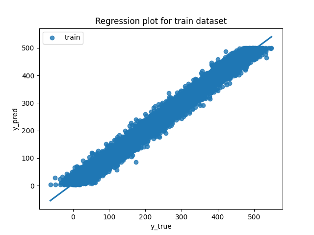

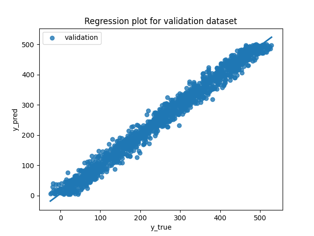

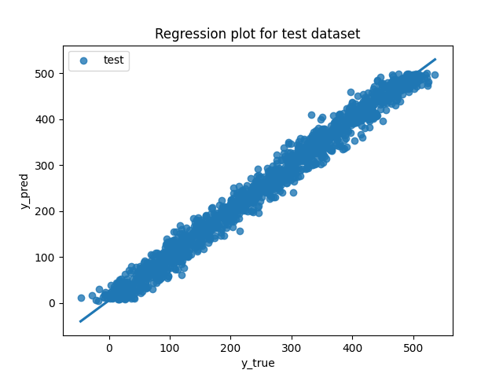

Las métricas de cada conjunto de datos se representan: 

### Evaluación de los resultados

Aquí tenéis ejemplos de resultados de evaluación para conjuntos de entrenamiento, validación y prueba.

Ejemplo para el conjunto de entrenamiento:

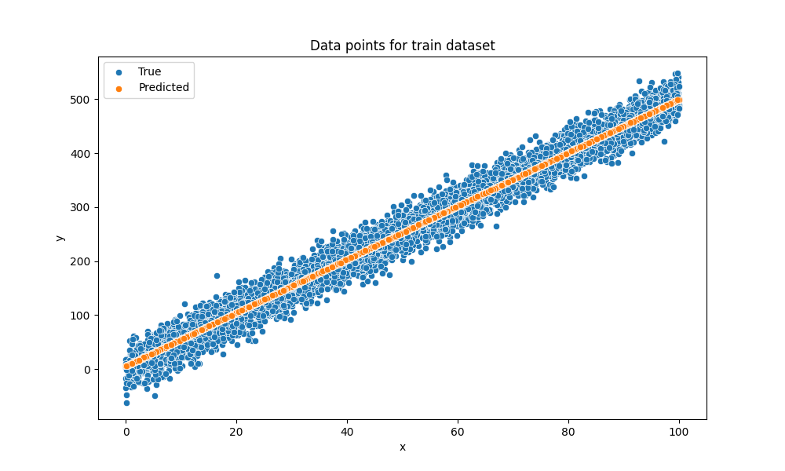

Ejemplo para el conjunto de validación:

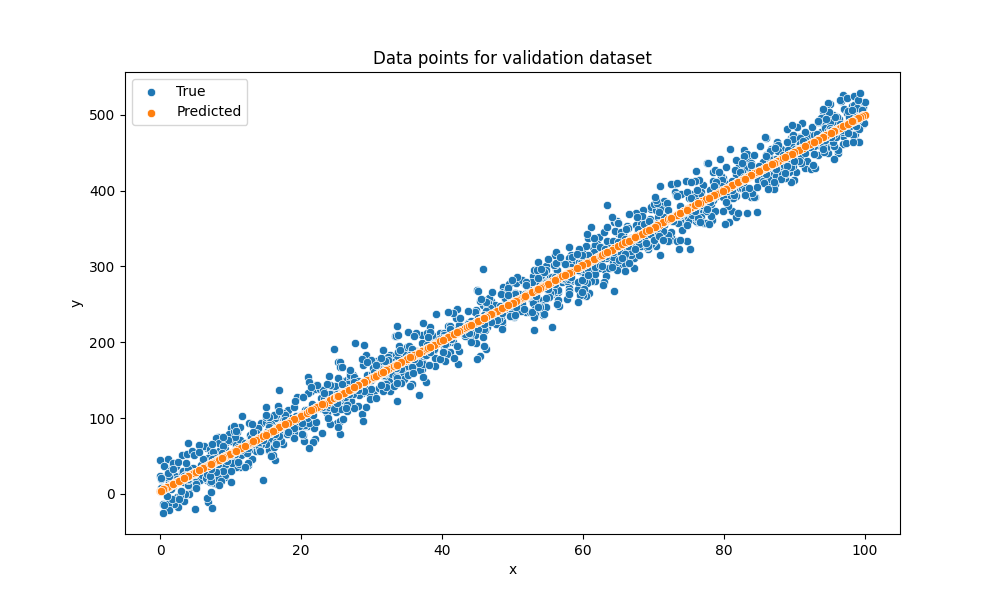

Ejemplo para el conjunto de pruebas:

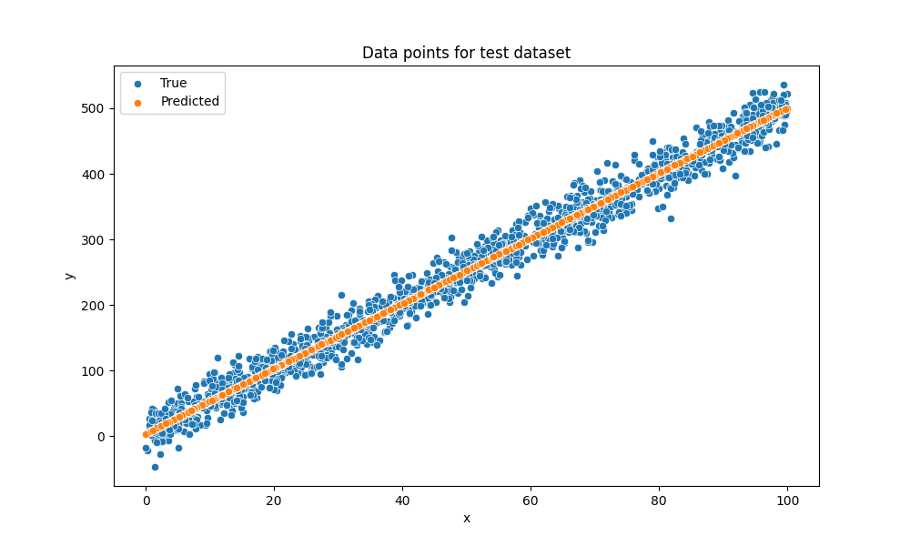

### Discusión de los resultados

*Tarea para el estudiante: ¿Hay sobreajuste, subajuste u otros problemas? ¿Cómo podemos mejorar el modelo? ¿Cómo va a generalizarse este modelo a nuevos datos?*

Las curvas de pérdida de entrenamiento y validación disminuyen de forma progresiva y mantienen valores muy similares durante todo el proceso de entrenamiento. No se observa una separación significativa entre ambas, lo que indica que no existe sobreajuste. Al mismo tiempo, la pérdida alcanza valores bajos y estables, por lo que no se aprecia subajuste, ya que el modelo es capaz de aprender adecuadamente la relación entre la entrada y la salida.

Este comportamiento se ve reforzado por las métricas obtenidas. Los valores de $R^2$ son muy similares y elevados en los tres conjuntos (entrenamiento, validación y test), lo que indica que el modelo explica correctamente la variabilidad de los datos. Asimismo, los valores de MSE y MAE son comparables entre los tres conjuntos, lo que sugiere un rendimiento consistente y estable.

En cuanto a la generalización, el modelo muestra un comportamiento similar en datos no vistos, como se observa en los gráficos de regresión y en las métricas del conjunto de test. Dado que el modelo es un perceptrón simple con pocos parámetros y el problema a resolver presenta una relación sencilla entre la entrada y la salida, el modelo aprende una función general y puede aplicarla a nuevos datos del mismo tipo.

Para mejorar el modelo podría utilizarse una arquitectura más compleja, como una red neuronal multicapa con una o varias capas ocultas. No obstante, para el problema planteado en este ejercicio, el perceptrón simple es suficiente y no se observan problemas relevantes de ajuste.

## Iteración del diseño

*Tarea para el estudiante: Describe el proceso que has seguido para mejorar el modelo y la evolución del rendimiento del modelo durante el proceso.*

*Puedes incluir una tabla que indique los chanched parameters y los resultados obtenidos tras el proceso.*

El proceso de diseño del modelo comenzó con la elección de un perceptrón simple como arquitectura base, de acuerdo con la naturaleza del problema. Se trata de una tarea de regresión con una relación sencilla entre la entrada y la salida, por lo que se consideró adecuado comenzar con un modelo simple y pocos parámetros.

En una primera ejecución, se entrenó el modelo utilizando los hiperparámetros proporcionados en el código base. Durante el entrenamiento se observó una disminución progresiva y estable de la función de pérdida tanto en el conjunto de entrenamiento como en el de validación. Además, las métricas obtenidas en validación y test fueron similares a las de entrenamiento, lo que indicó un buen comportamiento del modelo y ausencia de problemas de ajuste.

Dado que el modelo convergía correctamente y no se detectaron problemas de sobreajuste ni subajuste, no fue necesario introducir cambios adicionales en la arquitectura ni en los hiperparámetros. El modelo final se seleccionó en base a la mínima pérdida de validación, y su rendimiento se evaluó posteriormente sobre datos no vistos.

### Evolución del rendimiento

| Iteración | Arquitectura| Learning rate | Épocas | R² (test) | MSE (test) |
|----------|--------------|---------------|--------|-----------|------------|
| 1 | Perceptrón simple| 0.0001| 100| ≈ 0.98| ≈ 388|

Este proceso muestra que, para el problema planteado, un modelo sencillo es
suficiente para aprender la relación entre la entrada y la salida sin necesidad
de aumentar la complejidad del diseño.

## Preguntas adicionales

*Tarea para el estudiante: Responder a las siguientes preguntas. Incluye gráficos si es necesario. Almacenar los gráficos en la carpeta `outs/exercise_01`.*

### ¿Qué pasa si añades más parámetros al modelo?

Al añadir más parámetros (MLP con 10 neuronas ocultas), el modelo mantiene un rendimiento muy similar al caso base: R² ≈ 0.981–0.982 y MSE en test ≈ 387.

Las curvas de pérdida de entrenamiento y validación son parecidas, por lo que no se observa sobreajuste. En este problema, aumentar parámetros no aporta una mejora significativa porque la relación a aprender es sencilla.

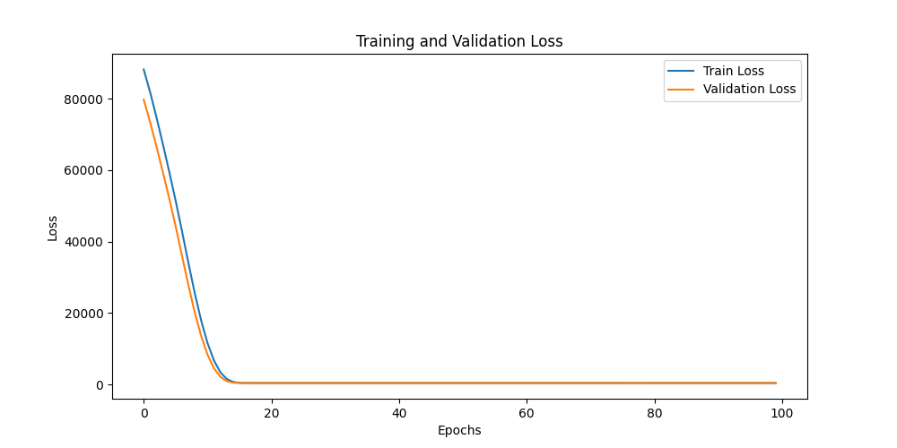

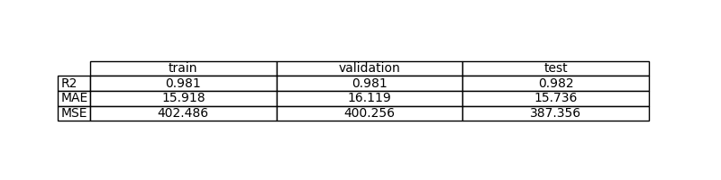

### ¿Qué pasa si añades más capas al modelo?

Al añadir más capas al modelo (utilizando una red neuronal con dos capas ocultas), se incrementa la complejidad de la arquitectura y el número de transformaciones no lineales que el modelo puede realizar.

Los resultados obtenidos muestran que el rendimiento del modelo con más capas es muy similar al de arquitecturas más simples. Las curvas de pérdida de entrenamiento y validación son parecidas y las métricas en entrenamiento, validación y test mantienen valores prácticamente iguales. Esto indica que, para una relación sencilla entre la entrada y la salida, añadir más capas no supone una mejora significativa y puede introducir complejidad innecesaria.

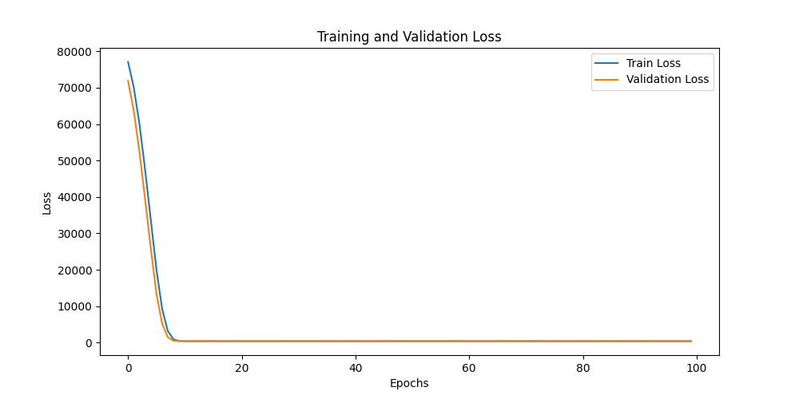

### ¿Qué ocurre si cambias la función de activación de la última capa a ReLU?

ReLU es una función de activación que se utiliza habitualmente en capas ocultas de redes neuronales. Su efecto es forzar la salida de la neurona a ser mayor o igual que cero.

En un problema de regresión como el de este ejercicio, la salida del modelo es una variable continua que no está limitada a un rango concreto. Si se aplica ReLU en la última capa, se introduce una restricción artificial en la salida del modelo, impidiendo la predicción de valores negativos o cercanos a cero. Esto reduce la capacidad del modelo para ajustarse correctamente a los datos reales.

Por tanto, el uso de ReLU en la última capa no es adecuado para esta tarea de regresión, ya que limita innecesariamente el rango de valores que el modelo puede representar y puede provocar un empeoramiento de las métricas de error.

### ¿Y a Sigmoid?

Sigmoid es una función de activación que transforma la salida de la neurona a un valor comprendido entre 0 y 1. Se utiliza principalmente en problemas de clasificación para interpretar la salida como una probabilidad.

En una tarea de regresión como la de este ejercicio, la variable de salida no está acotada a ese rango, sino que puede tomar valores continuos mucho mayores que 1. Si se utiliza Sigmoid en la última capa, el modelo queda limitado a producir salidas en el intervalo (0, 1), lo que impide representar correctamente los valores reales del problema.

Como consecuencia, el modelo no puede aproximar adecuadamente la relación entre la entrada y la salida, produciéndose un claro subajuste. Por este motivo, Sigmoid no es una función de activación adecuada en la última capa.

### ¿Qué pasa si cambias la velocidad de aprendizaje?

La velocidad de aprendizaje es un hiperparámetro que determina el tamaño del paso con el que se actualizan los pesos sinápticos durante el entrenamiento. Este valor multiplica el gradiente de la función de pérdida y controla cómo se ajustan los parámetros del modelo.

Si la velocidad de aprendizaje es demasiado pequeña, las actualizaciones de los pesos son muy reducidas y el entrenamiento puede ser muy lento, requiriendo un mayor número de épocas para que la función de pérdida disminuya de forma significativa. En este caso, el modelo puede tardar en converger.

Por el contrario, si la velocidad de aprendizaje es demasiado grande, las actualizaciones de los pesos pueden ser excesivas, provocando inestabilidad en el entrenamiento y dificultando la convergencia del modelo. Esto puede hacer que la función de pérdida oscile o no disminuya correctamente.

### Por favor, reduce los puntos de datos del conjunto de datos a 10 y crea 2 capas / 20 neuronas cada una. En este caso, ¿cómo puedes reducir el problema de sobreajuste?

Al reducir el conjunto de datos a solo 10 puntos y utilizar una red neuronal con dos capas ocultas y 20 neuronas por capa, el modelo pasa a tener una capacidad muy superior a la cantidad de información disponible en los datos. Esto provoca una situación en la que el modelo puede ajustar muy bien los datos de entrenamiento, pero perder capacidad de generalización, dando lugar a sobreajuste.

El sobreajuste ocurre cuando el modelo aprende en exceso los datos de entrenamiento y no generaliza correctamente a datos no vistos. En este caso, es esperable observar una pérdida de entrenamiento baja y una pérdida de validación o test mayor, indicando que el modelo no generaliza bien.

Para reducir este problema de sobreajuste, se propone el uso de técnicas de regularización. Entre ellas se encuentran la regularización L2, que penaliza valores grandes de los pesos sinápticos, la regularización L1, que fuerza muchos pesos a tomar valores cercanos a cero, y el Dropout, que desactiva aleatoriamente neuronas durante el entrenamiento. Estas técnicas limitan la complejidad efectiva del modelo y ayudan a mejorar su capacidad de generalización cuando se dispone de pocos datos.
