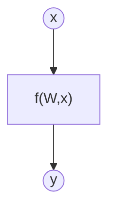
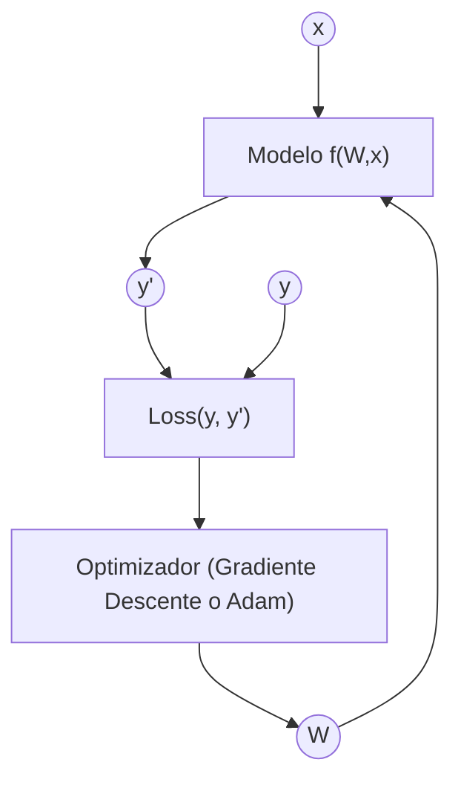
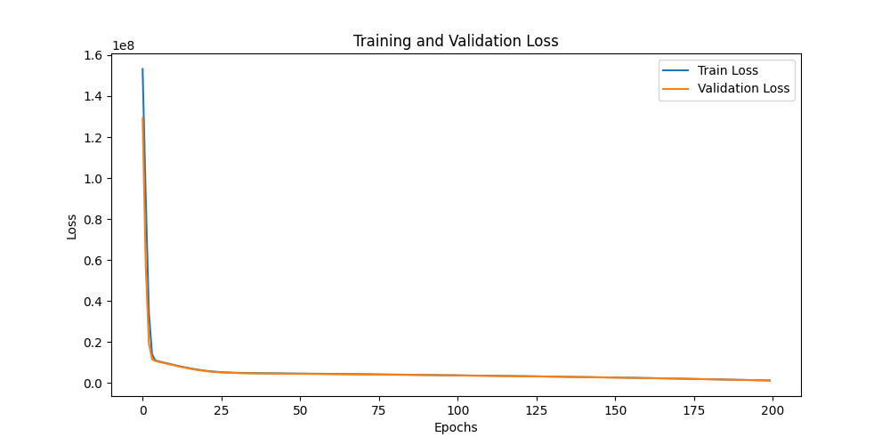
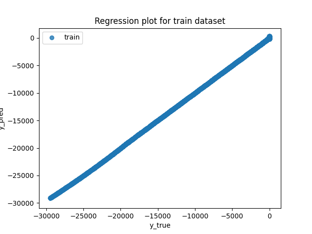
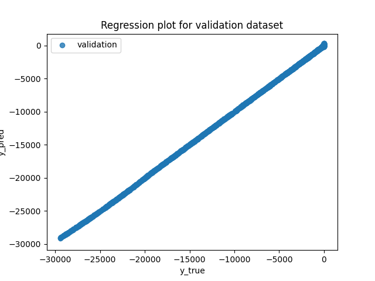
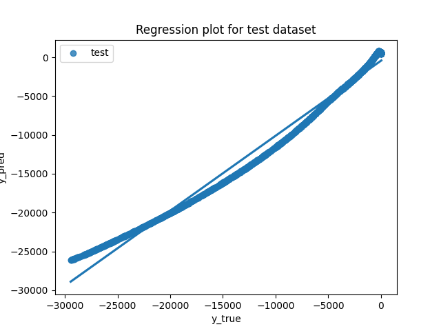
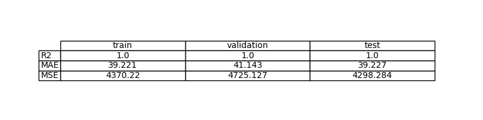
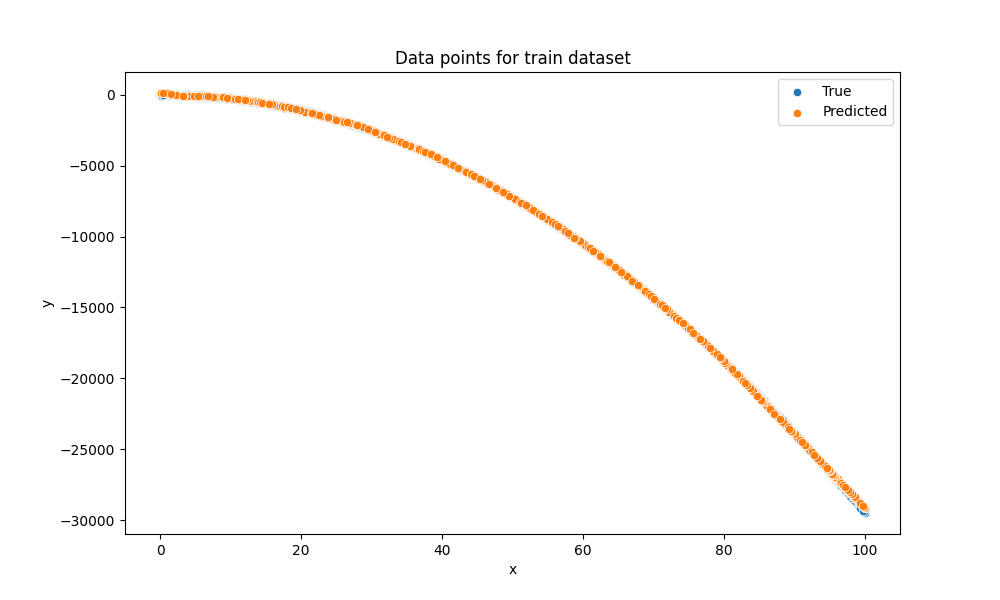
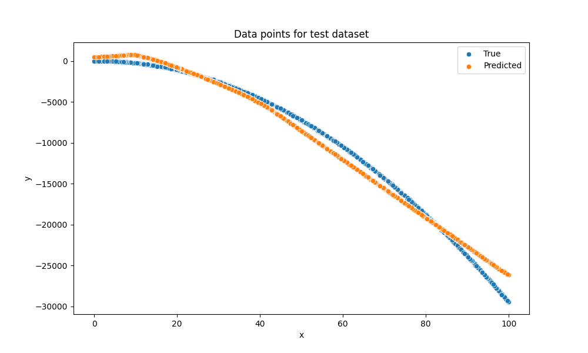

# Ejercicio 2: Aprende una función cuadrática con PyTorch

## Objetivo

Estimación de una función desconocida mediante un modelo de aprendizaje automático

## Formalización de tareas

La tarea que se puede formalizar en dos pasos. Primero, definiremos lo que intentamos lograr de la forma más clara posible. En segundo lugar, definiremos el enfoque que estamos adoptando para resolverlo.

### Formalización de tareas (Inferencia)

Existe una función desconocida $f$ para lo cual disponemos de un montón de datos sobre ciertas entradas $x$ y su salida correspondiente $y$.

$$
y = f(x)
$$

Estamos intentando crear un modelo de $f$ usando un método de aprendizaje automático para inferir la matriz de pesos de $W$ que exprese mejor la relación entre $x$-$y$ de datos. Expresado matemáticamente:

$$
y = f(W,x)
$$

Expresado gráficamente:

El vector de entrada tiene tamaño [bs x 1]. La matriz de pesos tiene un tamaño [1 x 1]

### Formalización de tareas (Entrenamiento)

#### Explicación del diagrama de entrenamiento

El diagrama representa el proceso completo de entrenamiento de un modelo de
Machine Learning entrenado mediante la minimización de una función de pérdida.

##### Elementos del diagrama

- x: vector de entrada del modelo (datos de entrada).
- y: valor real u objetivo.
- f(W, x): modelo o función parametrizada por los pesos W, que genera
  una predicción a partir de la entrada.
- y′: salida estimada o predicción del modelo.
- Loss: función de pérdida que mide la diferencia entre la predicción
  y′ y el valor real y.
- W: conjunto de parámetros (pesos sinápticos) del modelo que se ajustan
  durante el entrenamiento.

##### Flujo del proceso de aprendizaje

1. La entrada **x** se introduce en el modelo **f(W, x)**.
2. El modelo genera una predicción **y′**.
3. La predicción **y′** se compara con el valor real **y** mediante la función
   de pérdida **Loss(y, y′)**.
4. La función de pérdida produce un valor escalar que cuantifica el error del
   modelo.
5. Este error se utiliza para actualizar los pesos **W**, generalmente mediante
   un algoritmo de optimización basado en gradiente descendente.
6. Los pesos actualizados se realimentan al modelo, cerrando el ciclo de
   entrenamiento.

Este proceso se repite de forma iterativa hasta que la función de pérdida
converge o se alcanza un criterio de parada.

## Métricas de evaluación

Como estamos tratando con un problema de regresión, utilizaremos el error cuadrático medio (MSE), el error absoluto medio (MAE) y el R-cuadrado como métricas de evaluación.

## Consideraciones de datos

### Descripción del conjunto de datos

El conjunto de datos contiene 10000 puntos de datos ruidosos con una desviación estándar de ruido de 20 respecto a la función real ($y = -3x^2 + 5x$).

### Preparación y preprocesamiento de datos

No se ha realizado ningún preprocesado. El conjunto de datos se ha dividido en conjuntos de entrenamiento, validación y prueba.

### Aumento de datos

No se ha realizado ninguna ampliación de datos.

## Consideraciones del modelo

Para la función $y = -3x^2 + 5x$, un modelo lineal (SinglePerceptron) no es suficiente. Por ello utilizamos un perceptrón multicapa (MultilayerPerceptron) con una capa oculta (fc1) y activación ReLU, y activación identidad en la última capa (regresión sin límites). Esto permite capturar la no linealidad de la función objetivo.

### Funciones de pérdida adecuadas

La función de pérdida utilizada depende del tipo de problema:

- En regresión no lineal, se emplea el error cuadrático medio (MSE).
- En problemas de clasificación, se utiliza la entropía cruzada.

### Función de Pérdida Seleccionada

En esta tarea se utiliza la función de pérdida MSE (Mean Squared Error), ya que el problema planteado es un problema de regresión no lineal, en el que la salida del modelo es una variable continua.

La función MSE mide el error medio al cuadrado entre el valor real y y la predicción del modelo y′, y se define como:

$$\text{MSE} = \frac{1}{N} \sum_{i=1}^{N} (y_i - y'_i)^2$$

El objetivo del entrenamiento es ajustar los pesos sinápticos del modelo para minimizar esta función de pérdida mediante un algoritmo de optimización basado en gradiente descendente.

### Posibles arquitecturas

Se utiliza una arquitectura de perceptrón multicapa (MultilayerPerceptron) con 64 neuronas en la capa oculta. Esta arquitectura tiene múltiples parámetros (pesos y sesgos en fc1 y fc2) que se aprenden durante el entrenamiento: $W_1, b_1$ en la capa oculta y $W_2, b_2$ en la capa de salida.

### Activación de la última capa

Como es una tarea de regresión sin límites inferiores ni superiores, la activación de la última capa se establece en función Identidad.

### Otras consideraciones

Se usa `AdamW` como optimizador por su estabilidad y capacidad de convergencia. Para evitar saturar la salida, la última capa se deja sin activación (`Identity`).

## Entrenamiento

El entrenamiento se ha realizado a lo largo de 200 épocas. El gráfico de la función de pérdida se muestra a continuación.

### Hiperparámetros de entrenamiento

La tasa de aprendizaje se establece en 0,001

### Grafo de la función de pérdida

### Discusión sobre el proceso de entrenamiento

El loss de entrenamiento y validación disminuye rápidamente en las primeras épocas y luego se estabiliza. Las curvas se mantienen muy próximas, lo que indica buena generalización y ausencia de sobreajuste. El punto óptimo se alcanza alrededor de 200 épocas, donde la validación no mejora significativamente.

## Evaluación

### Métricas de evaluación

Las métricas obtenidas muestran un rendimiento alto (que se puede observar en la tabla) en train/validation/test, y errores MAE/MSE consistentes entre conjuntos. Esto indica que el modelo explica la mayor parte de la variabilidad de los datos y generaliza correctamente.

Las métricas de cada conjunto de datos se representan:

### Evaluación de los resultados

Imágenes de los resultados

Ejemplo para el conjunto de entrenamiento:

Ejemplo para el conjunto de validación:

Ejemplo para el conjunto de pruebas:

### Discusión de los resultados

¿Cómo resuelve el modelo el problema?

El modelo aprende la forma cuadrática de la función objetivo y reproduce correctamente la curvatura en los datos.

¿Hay sobreajuste, subajuste o algún otro problema? 

 No se observa sobreajuste importante, ya que train/validation/test son muy similares.

¿Cómo podemos mejorar el modelo?

Para mejorar el modelo, se podría ajustar el número de neuronas o aplicar early stopping. Si se observa que el valor de Validation Test disminuye en las últimas épocas se podria subir el número de epocas.

¿Cómo se generalizará este modelo a nuevos datos?

  Dado el alto $R^2$, se espera una buena generalización a nuevos datos generados con la misma distribución.

## Diseño de bucles de retroalimentación

Describe el proceso que has seguido para mejorar el modelo y la evolución del rendimiento del modelo durante el proceso.

Estrategia seguida:
1. Primero aumentar el learning rate (x10) (coste computacional nulo). 
2. Si no es suficiente, aumentar el número de épocas. (100-->200-->250)
3. Como último recurso, aumentar el número de neuronas.

Puedes incluir una tabla que indique los parámetros cambiados y los resultados obtenidos tras el proceso.

| Cambio | Antes | Después | Impacto observado |
|---|---|---|---|
| Modelo | `SimplePerceptron` | `MultiLayerPerceptron` | Mejor ajuste de la curva (no linealidad) |
| Neuronas ocultas | — | 64 | Mayor capacidad para aproximar $y = -3x^2 + 5x$ |
| Learning rate | 0.0001 | 0.001 | Convergencia más rápida |
| Épocas | 100 | 200 | Mejora del validation loss hasta estabilizar |

## Preguntas

Por favor, responde a las siguientes preguntas. Incluye gráficos si es necesario. Almacenar los gráficos en la carpeta `outs/exercise_02`.

### ¿Cuáles son las diferencias que encontraste entre el modelo anterior y este?

El modelo anterior era lineal (perceptrón simple, suficiente para la función anterior) y no podía aprender una relación cuadrática, produciendo un subajuste claro. El modelo actual es un perceptrón multicapa con activación no lineal, capaz de aproximar funciones no lineales, logrando un $R^2$ muy alto y errores menores.

### ¿El modelo se generaliza bien a datos nuevos?

Sí. Las métricas en train, validation y test son muy similares y el $R^2$ se mantiene alto en los tres conjuntos, lo que indica buena generalización.