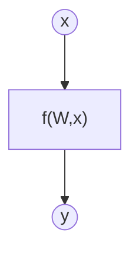

# Ejercicio 1: Aprende una función lineal con PyTorch

## Objetivo

Estimación de una función desconocida mediante un modelo de aprendizaje automático

## Formalización de tareas

La tarea que se puede formalizar en dos pasos. Primero, definiremos lo que intentamos lograr de la forma más clara posible. En segundo lugar, definiremos el enfoque que estamos adoptando para resolverlo.

### Formalización de tareas (Inferencia)

Existe una función desconocida $f$ para lo cual disponemos de un montón de datos sobre ciertas entradas $x$ y su salida correspondiente $y$.

$$
y = f(x)
$$

Estamos intentando crear un modelo de $f$ usando un método de aprendizaje automático para inferir la matriz de pesos de $W$ que exprese mejor la relación entre $x$-$y$ de datos. Expresado matemáticamente:

$$
y = f(W,x)
$$

Expresado gráficamente:

El vector de entrada tiene tamaño [bs x 1]. La matriz de pesos tiene un tamaño [1 x 1]

### Formalización de tareas (Entrenamiento)

Escribe tu respuesta aquí

## Métricas de evaluación

Como estamos tratando con un problema de regresión, utilizaremos el error cuadrático medio (MSE), el error absoluto medio (MAE) y el R-cuadrado como métricas de evaluación.

## Consideraciones de datos

### Descripción del conjunto de datos

El conjunto de datos contiene 100 puntos de datos ruidosos con una desviación estándar de ruido de 20 respecto a la función real (y = -3x^2+5x).

### Preparación y preprocesamiento de datos

No se ha realizado ningún preprocesado. El conjunto de datos se ha dividido en conjuntos de entrenamiento, validación y prueba.

### Aumento de datos

No se ha realizado ninguna ampliación de datos.

## Consideraciones del modelo

Escribe tu respuesta aquí.

### Funciones de pérdida adecuadas

Escribe tu respuesta aquí.

### Función de Pérdida Seleccionada

Como es una tarea de regresión, se utiliza la función MSE.

Se elige esta función de coste ya que se trata de predecir números.

### Posibles arquitecturas

Se utiliza una arquitectura de perceptrón simple como base. Esta arquitectura tiene dos parámetros: $W$ y $b$, y se aprenden durante el entrenamiento.

### Activación de la última capa

Como es una tarea de regresión sin límites inferiores ni superiores, la activación de la última capa se establece en función Identidad.

### Otras consideraciones

Añadir lo que consideremos oportuno

## Entrenamiento

El entrenamiento se ha realizado a lo largo de 100 épocas. El gráfico de la función de pérdida se muestra a continuación.

### Hiperparámetros de entrenamiento

La tasa de aprendizaje se establece en 0,0001

### Grafo de la función de pérdida

### Discusión sobre el proceso de entrenamiento

Escribe tu respuesta aquí.

## Evaluación

### Métricas de evaluación

Escribe tu respuesta aquí.

Las métricas de cada conjunto de datos se representan:

### Evaluación de los resultados

Aquí tenéis ejemplos de resultados de evaluación para conjuntos de entrenamiento, validación y prueba.

Ejemplo para el conjunto de entrenamiento:

Ejemplo para el conjunto de validación:

Ejemplo para el conjunto de pruebas:

### Discusión de los resultados

¿Cómo resuelve el modelo el problema?
¿Hay sobreajuste, subajuste o algún otro problema? 
¿Cómo podemos mejorar el modelo?
¿Cómo se generalizará este modelo a nuevos datos?

## Diseño de bucles de retroalimentación

Describe el proceso que has seguido para mejorar el modelo y la evolución del rendimiento del modelo durante el proceso.

Puedes incluir una tabla que indique los chanched parameters y los resultados obtenidos tras el proceso.

## Preguntas

Por favor, responde a las siguientes preguntas. Incluye gráficos si es necesario. Almacenar los gráficos en la carpeta `outs/exercise_02`.

### ¿Cuáles son las diferencias que encontraste entre el modelo anterior y este?

### ¿El modelo se generaliza bien a datos nuevos?