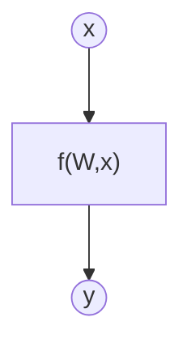

# Exercise 1: Learn a linear function with PyTorch

## Objective

Estimation of a unknown function by a machine learning model

## Task Formalization

The task in hand can be formalized in two steps. First, we will define what we are tring to achieve as clearlly as possible. Second, we will define the approach we are taking to solve it.

### Task Formalization (Inference)

There is an unknown function $f$ for which we have a bunch of data about certain input $x$ and its corresponding output $y$.

$$
y = f(x)
$$

We are trying to create a model of $f$ using a Machine Learning method to infer the $W$ weight matrix that better expreses the relationship between $x$-$y$ pair of data. Mathematically expressed:

$$
y = f(W,x)
$$

Graphically expressed:

The input vector has size [bs x 1]. The weight matrix has size [1 x 1]

### Task Formalization (Training)

Write your answer here

## Evaluation metrics

Since we are dealing with a regression problem, we will use the mean squared error (MSE), mean absolute error (MAE), and R-squared as evaluation metrics.

## Data Considerations

### Dataset description

Dataset contains 100 noisy data points with a noise standard deviation of 20 from the true function (y = -3x^2+5x).

### Data preparation and preprocessing

No preprocessing has been performed. Dataset has been split into train, validation, and test sets.

### Data augmentation

No data augmentation has been performed.

## Model Considerations

Write your answer here

### Suitable Loss Functions

Write your answer here

### Selected Loss Function

As it is a regression task, MSE loss is used.

Se elige esta función de coste ya que se trata de predecir números.

### Possible architectures

A simple perceptron architecture is used as a baseline. This architecture has two parameters: W and b and they are learned during training.

**

### Last layer activation

As it is a regression task with no lower and upper limits, the last layer activation is set to Identity function.

### Other Considerations

Añadir lo que consideremos oportuno

## Training

Training has been performed during the course of 100 epochs. The loss function graph is shown below.

### Training hyperparameters

Learning rate is set to 0.0001
**

### Loss function graph

### Discussion of the training process

Write your answer here

## Evaluation

### Evaluation metrics

Write your answer here

Metrics for each dataset is depicted: 

### Evaluation results

Here you have examples of evaluation results for train, validation and test sets.

Example for train set:

Example for validation set:

Example for test set:

### Discussion of the results

How the model solves the problem?
Is there overfitting, underfitting or any other issues? 
How can we improve the model?
How this model will generalize to new data?

## Design Feedback loops

Describe the process you have followed to improve the model and the evolution of performance of the model during the process.

You can include a table stating the chanched parameters and the obtained results after the process.

## Questions

Pleaser answer the following questions. Include graphs if necessary. Store the graphs in the `outs/exercise_02` folder.

### Which are the differences you found between previous model and this one?

### Does the model generalizes well to new data?

