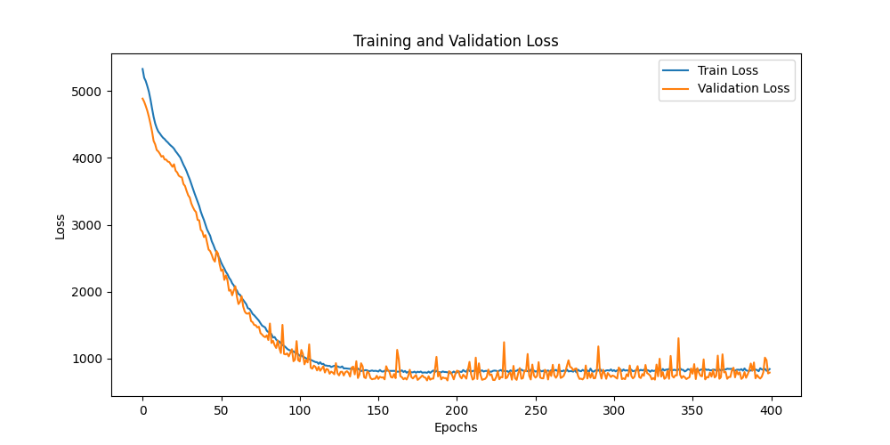
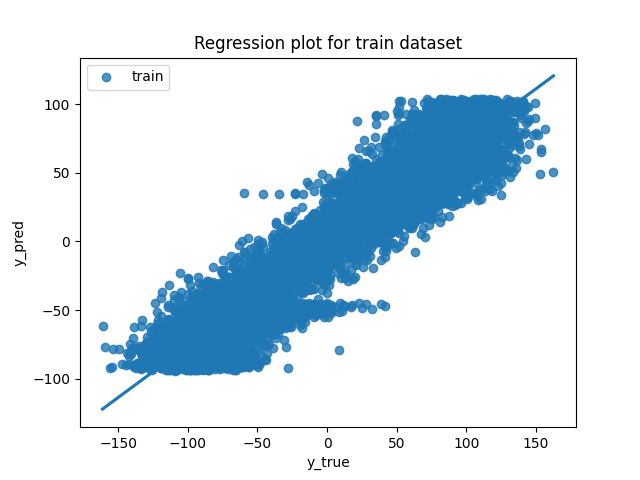
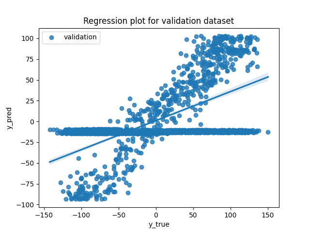
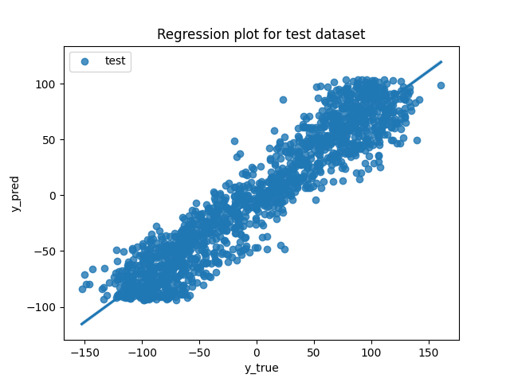
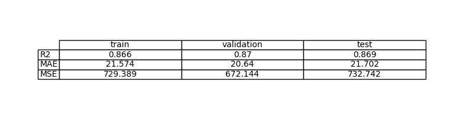
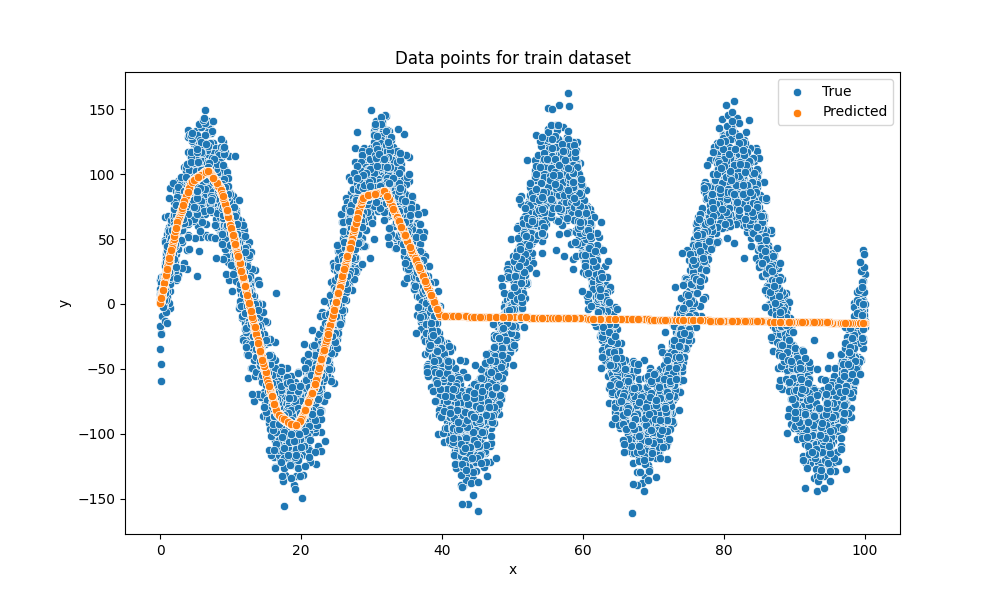
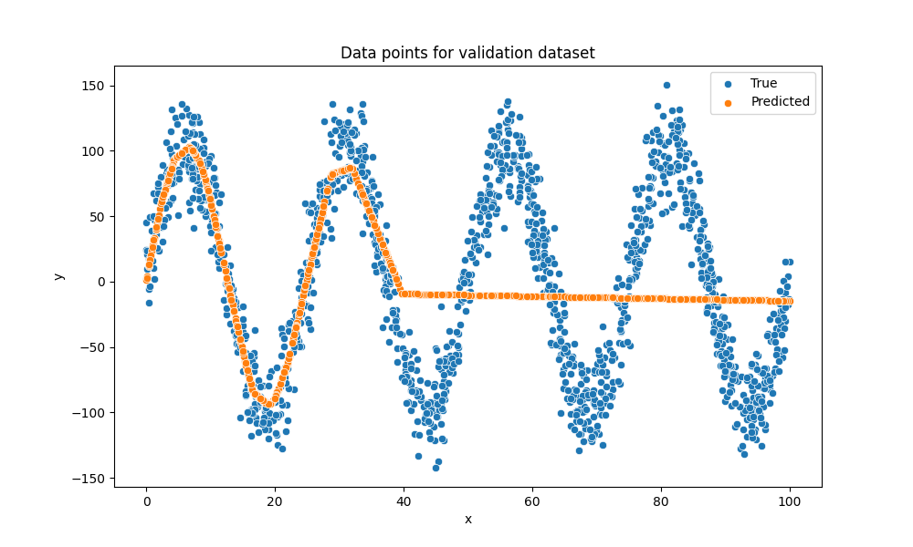
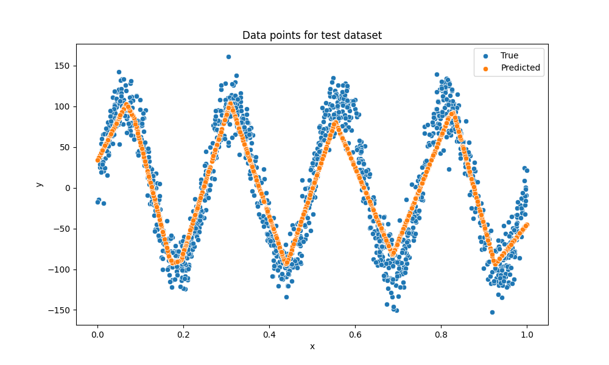

# Ejercicio 1: Aprende una función lineal con PyTorch

## Objetivo

Estimación de una función desconocida mediante un modelo de aprendizaje automático

## Formalización de tareas

Escribe tu respuesta aquí.

### Formalización de tareas (Inferencia)

Escribe tu respuesta aquí.

### Formalización de tareas (Entrenamiento)

Escribe tu respuesta aquí.

## Métricas de evaluación

Escribe tu respuesta aquí.

## Consideraciones de datos

### Descripción del conjunto de datos

Escribe tu respuesta aquí.

### Preparación y preprocesamiento de datos

Escribe tu respuesta aquí.

### Aumento de datos

Escribe tu respuesta aquí.

## Consideraciones del modelo

Escribe tu respuesta aquí.

### Funciones de pérdida adecuadas

Escribe tu respuesta aquí.

### Función de Pérdida Seleccionada

Escribe tu respuesta aquí.

### Posibles arquitecturas

Escribe tu respuesta aquí.

### Activación de la última capa

Escribe tu respuesta aquí.

### Otras consideraciones

Escribe tu respuesta aquí.

## Entrenamiento

Escribe tu respuesta aquí.

### Hiperparámetros de entrenamiento

Escribe tu respuesta aquí.

### Grafo de la función de pérdida

### Discusión sobre el proceso de entrenamiento

Escribe tu respuesta aquí.

## Evaluación

### Métricas de evaluacións

Escribe tu respuesta aquí.

Las métricas de cada conjunto de datos se representan:

### Evaluación de los resultados

Aquí tenéis ejemplos de resultados de evaluación para conjuntos de entrenamiento, validación y prueba.

Ejemplo para el conjunto de entrenamiento:

Ejemplo para el conjunto de validación:

Ejemplo para el conjunto de pruebas:

### Discusión de los resultados

¿Cómo resuelve el modelo el problema?
¿Hay sobreajuste, subajuste o algún otro problema? 
¿Cómo podemos mejorar el modelo?
¿Cómo se generalizará este modelo a nuevos datos?

## Diseño de bucles de retroalimentación

Describe el proceso que has seguido para mejorar el modelo y la evolución del rendimiento del modelo durante el proceso.

Puedes incluir una tabla que indique los chanched parameters y los resultados obtenidos tras el proceso.

## Preguntas

Por favor, responde a las siguientes preguntas. Incluye gráficos si es necesario. Almacenar los gráficos en la carpeta `outs/exercise_03`.

### ¿Cuáles son las diferencias que encontraste entre el modelo anterior y este?

### ¿El modelo se generaliza bien a datos nuevos?