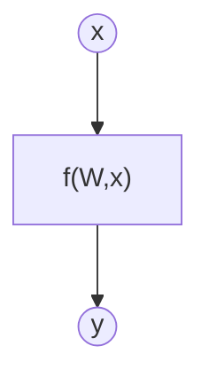
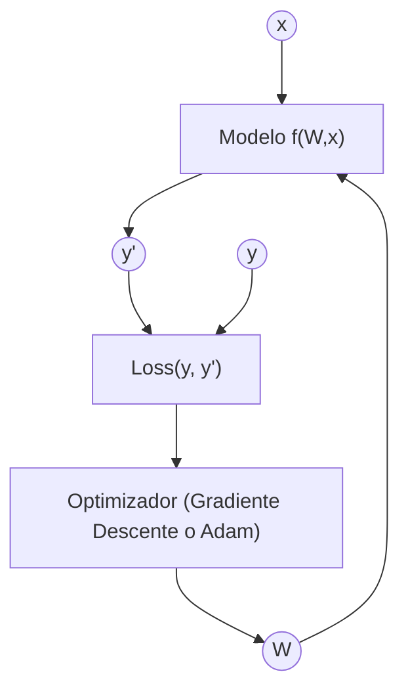

# Ejercicio 3: Aprende una función sinuidal con PyTorch

## Objetivo

Estimación de una función desconocida mediante un modelo de aprendizaje automático

## Formalización de tareas

La tarea se puede formalizar en dos pasos. Primero, definiremos lo que intentamos lograr de la forma más clara posible. En segundo lugar, definiremos el enfoque que estamos adoptando para resolverlo.

### Formalización de tareas (Inferencia)

Existe una función desconocida $f$ para lo cual disponemos de un montón de datos sobre ciertas entradas $x$ y su salida correspondiente $y$.

$$
y = f(x)
$$

Estamos intentando crear un modelo de $f$ usando un método de aprendizaje automático para inferir la matriz de pesos de $W$ que exprese mejor la relación entre $x$-$y$ de datos. Expresado matemáticamente:

$$
y = f(W,x)
$$

Expresado gráficamente:

El vector de entrada tiene tamaño [bs x 1]. La matriz de pesos tiene un tamaño [1 x 1]

### Formalización de tareas (Entrenamiento)

#### Explicación del diagrama de entrenamiento

El diagrama representa el proceso completo de entrenamiento de un modelo de Machine Learning entrenado mediante la minimización de una función de pérdida.

##### Elementos del diagrama

- x: vector de entrada del modelo (datos de entrada).
- y: valor real u objetivo.
- f(W, x): modelo o función parametrizada por los pesos W, que genera
  una predicción a partir de la entrada.
- y′: salida estimada o predicción del modelo.
- Loss: función de pérdida que mide la diferencia entre la predicción
  y′ y el valor real y.
- W: conjunto de parámetros (pesos sinápticos) del modelo que se ajustan
  durante el entrenamiento.

##### Flujo del proceso de aprendizaje

1. La entrada **x** se introduce en el modelo **f(W, x)**.
2. El modelo genera una predicción **y′**.
3. La predicción **y′** se compara con el valor real **y** mediante la función
   de pérdida **Loss(y, y′)**.
4. La función de pérdida produce un valor escalar que cuantifica el error del
   modelo.
5. Este error se utiliza para actualizar los pesos **W**, generalmente mediante
   un algoritmo de optimización basado en gradiente descendente.
6. Los pesos actualizados se realimentan al modelo, cerrando el ciclo de
   entrenamiento.

Este proceso se repite de forma iterativa hasta que la función de pérdida
converge o se alcanza un criterio de parada.

## Métricas de evaluación

Como estamos tratando con un problema de regresión, utilizaremos el error cuadrático medio (MSE), el error absoluto medio (MAE) y el R-cuadrado como métricas de evaluación.

## Consideraciones de datos

### Descripción del conjunto de datos

El conjunto de datos contiene 10000 puntos de datos ruidosos con una desviación estándar de ruido de 20 respecto a la función real ($y = 100 · sin(8 · π · x / 100) + 2$).

### Preparación y preprocesamiento de datos

No se ha realizado ningún preprocesado. El conjunto de datos se ha dividido en conjuntos de entrenamiento, validación y prueba.

### Aumento de datos

No se ha realizado ninguna ampliación de datos.

## Consideraciones del modelo

Para la función $y = 100 · sin(8 · π · x / 100) + 2$, un modelo lineal (SinglePerceptron) no es suficiente, ya que solo puede representar relaciones lineales entre la entrada y la salida.

Por este motivo se utiliza un perceptrón multicapa (MultiLayerPerceptron) con dos capas ocultas (fc1 y fc2) y función de activación ReLU. Esta arquitectura permite introducir no linealidad en el modelo y capturar la forma sinusoidal de la función objetivo. En la última capa se utiliza una activación identidad, ya que se trata de una tarea de regresión y la salida no debe estar limitada a un rango concreto.

### Funciones de pérdida adecuadas

La función de pérdida utilizada depende del tipo de problema:

- En regresión no lineal, se emplea el error cuadrático medio (MSE).
- En problemas de clasificación, se utiliza la entropía cruzada.

### Función de Pérdida Seleccionada

En esta tarea se utiliza la función de pérdida MSE (Mean Squared Error), ya que el problema planteado es un problema de regresión no lineal, en el que la salida del modelo es una variable continua.

La función MSE mide el error medio al cuadrado entre el valor real y y la predicción del modelo y′, y se define como:

$$\text{MSE} = \frac{1}{N} \sum_{i=1}^{N} (y_i - y'_i)^2$$

El objetivo del entrenamiento es ajustar los pesos sinápticos del modelo para minimizar esta función de pérdida mediante un algoritmo de optimización basado en gradiente descendente.

### Posibles arquitecturas

Para problemas de **regresión no lineal** existen distintas arquitecturas posibles:

- Modelo lineal (perceptrón simple): este tipo de modelo solo puede representar relaciones lineales entre la entrada y la salida. Por tanto, no es adecuado para funciones no lineales como una función sinusoidal, ya que no puede capturar cambios periódicos ni curvaturas en los datos.

- Perceptrón multicapa (MLP): los modelos con una o más capas ocultas y funciones de activación no lineales permiten aproximar funciones no lineales complejas. Un MLP con activaciones no lineales es un aproximador universal, por lo que resulta adecuado para modelar funciones continuas.

Dado que la función objetivo presenta un comportamiento claramente no lineal y periódico, la arquitectura más indicada es un perceptrón multicapa con capas ocultas y activaciones no lineales, manteniendo una activación identidad en la capa de salida al tratarse de un problema de regresión.

### Activación de la última capa

Al tratarse de una tarea de regresión, en la que la variable de salida no está acotada por límites inferiores ni superiores, se utiliza una función de activación identidad en la última capa. De este modo, el modelo puede predecir valores reales sin restricciones en su rango.

### Otras consideraciones

La entrada x se ha normalizado para mejorar la estabilidad del entrenamiento y facilitar la optimización. Al trabajar con valores en un rango reducido, el descenso por gradiente converge de forma más suave y estable, lo que se refleja en una reducción clara de la función de pérdida.

La salida no se normaliza, ya que el modelo aprende directamente la escala real de la variable objetivo y los resultados se interpretan en unidades originales.

Se utiliza el optimizador AdamW debido a su estabilidad durante el entrenamiento y a su buena capacidad de convergencia. Al tratarse de una tarea de regresión sin restricciones en el rango de salida, la última capa se mantiene sin función de activación, utilizando una función identidad.

## Entrenamiento

El entrenamiento se ha realizado a lo largo de 400 épocas. El gráfico de la función de pérdida se muestra a continuación.

### Hiperparámetros de entrenamiento

La tasa de aprendizaje se establece en 0.001. El entrenamiento se realiza durante 400 épocas, utilizando un batch size de 10. El modelo emplea dos capas ocultas con un número 128 de neuronas por capa.

### Grafo de la función de pérdida

### Discusión sobre el proceso de entrenamiento [CAMBIARLO]

### Discusión sobre el proceso de entrenamiento

Durante el entrenamiento se observa una disminución progresiva de la función de pérdida tanto en el conjunto de entrenamiento como en el de validación. En las primeras épocas la pérdida desciende de forma más pronunciada, mientras que a medida que avanza el entrenamiento la mejora se vuelve más gradual, lo que indica una convergencia estable del modelo.

Las curvas de entrenamiento y validación muestran un comportamiento similar y no se separan de forma significativa, lo que sugiere que el modelo no presenta sobreajuste. La normalización de la entrada contribuye a una evolución más suave de la pérdida y a una mayor estabilidad del proceso de optimización.

A partir de 400 épocas la mejora en la pérdida de validación es limitada, por lo que aumentar el número de épocas no produce una ganancia significativa. Por este motivo, el entrenamiento se detiene, seleccionando el modelo con mejor rendimiento en el conjunto de validación.

## Evaluación

### Métricas de evaluacións

Para evaluar el rendimiento del modelo se utiliza: MSE (Mean Squared Error), MAE (Mean Absolute Error) y el coeficiente de determinación R^2. Estas métricas permiten analizar tanto la magnitud del error como la capacidad del modelo para explicar la variabilidad de los datos.

El MSE penaliza con mayor peso los errores grandes y resulta adecuado para analizar el ajuste global del modelo. El MAE proporciona una medida más directa del error medio cometido, mientras que el coeficiente R^2 indica qué proporción de la variabilidad de la variable objetivo es explicada por el modelo.

Las gráficas de regresión para los conjuntos de entrenamiento, validación y prueba muestran que el modelo es capaz de capturar la tendencia global de la función sinusoidal. Aunque existe dispersión debida al ruido presente en los datos, las predicciones se alinean razonablemente con los valores reales en los tres conjuntos.

La similitud entre los resultados obtenidos en entrenamiento, validación y test indica que el modelo generaliza correctamente y no presenta un sobreajuste significativo.

Las métricas de cada conjunto de datos se representan:

### Evaluación de los resultados

Aquí tenéis ejemplos de resultados de evaluación para conjuntos de entrenamiento, validación y prueba.

Ejemplo para el conjunto de entrenamiento:

Ejemplo para el conjunto de validación:

Ejemplo para el conjunto de pruebas:

### Discusión de los resultados

¿Cómo resuelve el modelo el problema?

El modelo resuelve el problema aproximando la relación no lineal entre la entrada y la salida mediante un perceptrón multicapa con funciones de activación ReLU. La red es capaz de capturar la tendencia global de la función sinusoidal, suavizando el ruido presente en los datos y ajustando correctamente la forma general de la señal.

¿Hay sobreajuste, subajuste o algún otro problema?

No se observa un sobreajuste significativo, ya que el comportamiento de la función de pérdida y las métricas obtenidas en los conjuntos de entrenamiento, validación y prueba son similares. Tampoco se aprecia un subajuste claro, dado que el modelo aprende la estructura no lineal de los datos. La dispersión residual se debe principalmente al ruido añadido al conjunto de datos.

¿Cómo podemos mejorar el modelo?

El modelo podría mejorarse aumentando su capacidad, por ejemplo mediante más capas ocultas o un mayor número de neuronas, o ajustando los hiperparámetros de entrenamiento. No obstante, los experimentos realizados muestran que estas mejoras tienen un impacto limitado.

¿Cómo se generalizará este modelo a nuevos datos?

Dado que las métricas obtenidas en el conjunto de prueba son comparables a las de entrenamiento y validación, se espera que el modelo generalice correctamente a nuevos datos generados a partir de la misma distribución. La capacidad de generalización está respaldada por el uso de un conjunto de validación durante el entrenamiento y por la ausencia de diferencias significativas entre los distintos conjuntos.

## Diseño de bucles de retroalimentación

Describe el proceso que has seguido para mejorar el modelo y la evolución del rendimiento del modelo durante el proceso.

Puedes incluir una tabla que indique los chanched parameters y los resultados obtenidos tras el proceso.

El proceso de mejora del modelo se ha realizado de forma iterativa, utilizando el conjunto de validación como referencia para evaluar el impacto de los cambios introducidos. En una primera fase se empleó una arquitectura sencilla con una sola capa oculta y activación ReLU, observándose que el modelo no era capaz de ajustar adecuadamente la función objetivo.

Posteriormente, se aumentó la complejidad del modelo incorporando una segunda capa oculta, lo que permitió reducir la pérdida de validación. Sin embargo, incrementar el número de neuronas por capa no produjo una mejora significativa en este punto, por lo que se descartó esta opción inicialmente.

La mejora más relevante se obtuvo al introducir la normalización de la entrada. Este cambio permitió una reducción clara de la función de pérdida y una evolución más estable del entrenamiento. A partir de este punto, aumentar el número de épocas produjo mejoras progresivas en validación, hasta alcanzar un valor de pérdida considerablemente menor.

Finalmente, se comprobó que el perceptrón simple no era capaz de seguir la forma sinusoidal de la función, confirmando que una arquitectura lineal no es adecuada para este problema.

La siguiente tabla resume los principales cambios realizados y los resultados obtenidos en cada iteración.

| Arquitectura / Cambios                   | Épocas | Neuronas | Normalización | Best val loss |
|------------------------------------------|--------|----------|---------------|---------------|
| 1 capa oculta                            | 400    | 64       | No            | 3711          |
| 2 capas ocultas                          | 200    | 64       | No            | 3294          |
| 2 capas ocultas                          | 200    | 128      | No            | 3294          |
| 2 capas ocultas                          | 200    | 64       | Sí            | 2425          |
| 2 capas ocultas                          | 300    | 64       | Sí            | 2415          |
| 2 capas ocultas                          | 400    | 64       | Sí            | 2398          |
| 2 capas ocultas                          | 400    | 128      | Sí            | 672           |
| 2 capas ocultas                          | 500    | 128      | Sí            | 672           |

## Preguntas

Por favor, responde a las siguientes preguntas. Incluye gráficos si es necesario. Almacenar los gráficos en la carpeta `outs/exercise_03`.

### ¿Cuáles son las diferencias que encontraste entre el modelo anterior y este?

La principal diferencia entre el modelo anterior y el actual es la capacidad para modelar relaciones no lineales. Mientras que el modelo anterior, más simple, no era capaz de seguir adecuadamente la forma sinusoidal de la función objetivo, el modelo actual, basado en un perceptrón multicapa con activaciones ReLU, consigue aproximar la tendencia global de la señal.

Además, la normalización de la entrada en este ejercicio ha tenido un impacto significativo en el rendimiento del modelo, permitiendo una reducción clara de la función de pérdida y un entrenamiento más estable. Esto supone una mejora notable respecto al modelo anterior, donde la ausencia de normalización limitaba la capacidad de ajuste.

### ¿El modelo se generaliza bien a datos nuevos?

Sí, el modelo se generaliza adecuadamente a datos nuevos generados a partir de la misma distribución. Esto se observa en la similitud de las métricas obtenidas en los conjuntos de entrenamiento, validación y test, así como en el comportamiento coherente de las predicciones en las gráficas correspondientes.

La ausencia de diferencias significativas entre los distintos conjuntos indica que el modelo no presenta sobreajuste y que ha aprendido la estructura subyacente de los datos, más allá del ruido presente en el conjunto de entrenamiento.