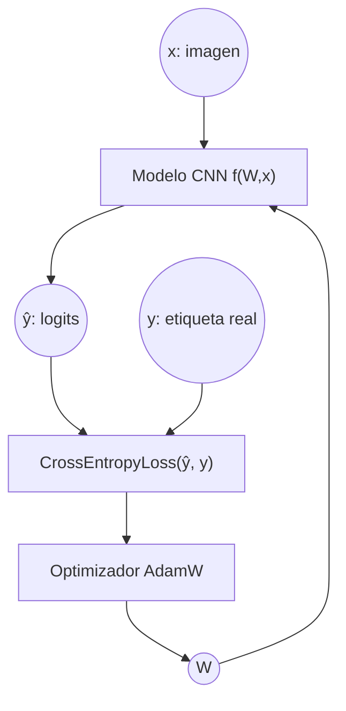
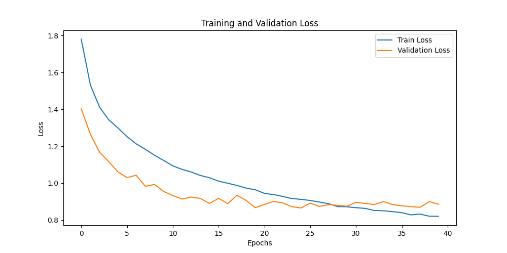
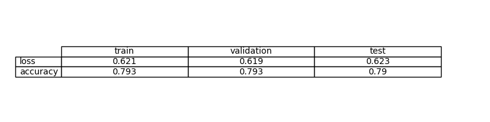
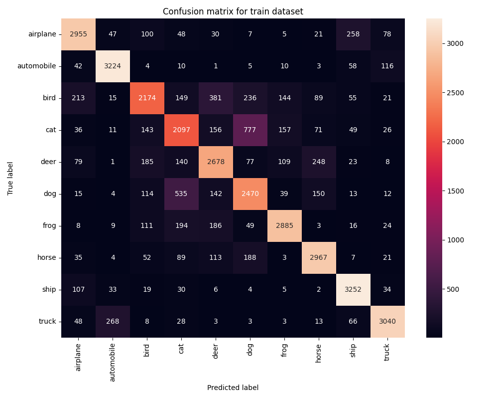
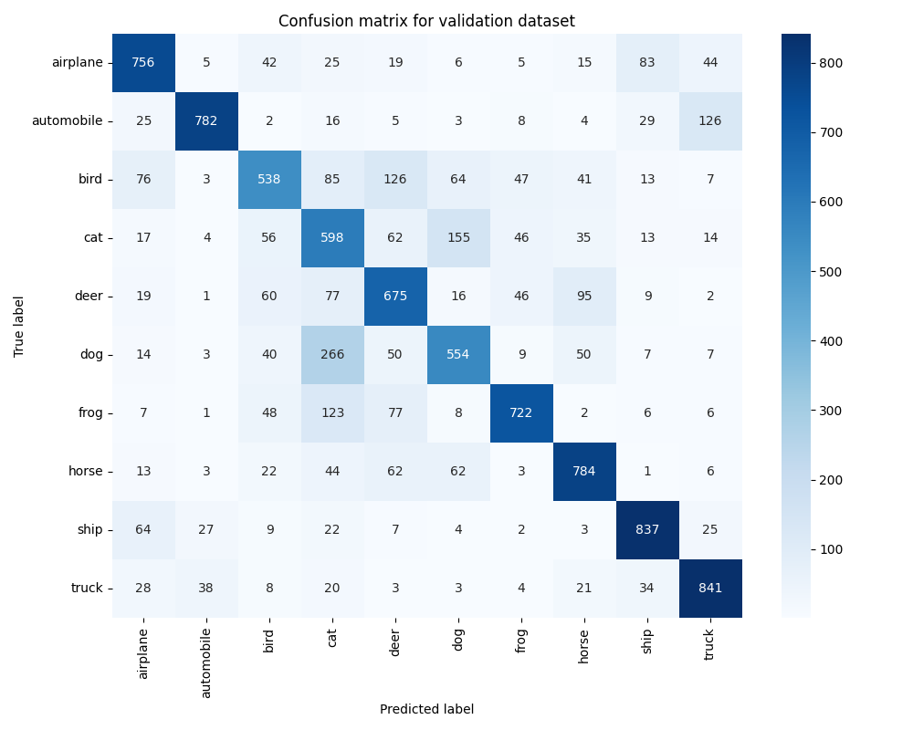

# Ejercicio 4: Crear un Modelo de Aprendizaje Profundo para la clasificación de imágenes en PyTorch con el conjunto de datos CIFAR-10

## Objetivo

Desarrollar un modelo que pueda clasificar imágenes del conjunto de datos CIFAR-10

Luego prueba un modelo con capas convolucionales. Crear un archivo evaluate.py que evalúe el modelo y calcule y almacene las métricas de evaluación, incluyendo una matriz de confusión

Compara este método con el anterior (ejercicio anterior) ¿Cuál es el efecto de la ampliación de datos?

La ampliación de datos introduce variaciones (Rotaciones, Traslaciones, Zoom, etc) para reducir el overfitting, ya que el modelo ve versiones diferentes de una misma imagen. Debe mostrar mejora sobre una red convolucional sin ampliación de datos.

Compara ambos métodos y comenta las diferencias

La diferencia es que una CNN sin ampliación de datos tiende a memorizar el conjunto de entrenamiento (train dataset), tiene peor precisión en el test y no es muy robusto a variaciones en la imagen.
Con ampliación de datos la CNN generaliza mejor, aprende patrones visuales y tiene menor sobreajuste.

## Formalización de tareas

La tarea puede formalizarse en dos pasos:

1. Definir el problema de clasificación supervisada con imágenes de entrada.
2. Establecer el enfoque basado en aprendizaje profundo mediante redes convolucionales para resolverlo.

Se trata de un problema de clasificación multiclase donde cada imagen debe asignarse a una de las 10 categorías del conjunto CIFAR-10, utilizando capas convolucionales que preserven la estructura espacial de las imágenes.

### Formalización de tareas (Inferencia)

La red convilucional debe aprender a asignar cada imagen del CIFAR-10 una de las 10 clases posibles.
$$ R^{32X32X3} --> {0, ..., 9} $$

Durante la inferencia, la red ya tiene todos sus parámetros entrenados, así que simplemente aplica esa función aprendida a las imágenes correspondientes.

Estamos intentado crear un modelo CNN usando una estructura VGGNet que reduce el número de parámetros en las capas de convolución y mejora el tiempo de entrenamiento.

Input (3x32x32) -> Conv(3→32) + ReLU -> MaxPool (↓ tamaño a 16x16) -> Conv(32→64) + ReLU -> MaxPool (↓ tamaño a 8x8)

Después se aplana y pasa por capas lineales:

-> Flatten -> Linear + ReLU -> Dropout -> Linear

La entrada al modelo de cada imagen $$ x ∈ R^32X32X3 $$ y cuando se procesa en lotes $$ x ∈ R^ {bsX32X32X3} $$ donde bs es el batch size.

La predicción del modelo es la clase con mayor probabilidad.

$$ y'=argmaxp_i $$

La función completa es $$ 𝑦
=𝑓(𝑊,𝑋) $$
pero ahora 𝑊 representa todos los pesos de todas las capas, no una matriz 1×1.

### Formalización de tareas (Entrenamiento)

#### Explicación del diagrama de entrenamiento

El diagrama representa el proceso completo de entrenamiento de un modelo de clasificación multiclase basado en una Red Neuronal Convolucional (CNN), entrenado mediante la minimización de la función de pérdida Cross-Entropy.

##### Elementos del diagrama

- x: imagen de entrada del conjunto CIFAR-10 (3x32x32), posiblemente aumentada mediante transformaciones.
- y: etiqueta real asociada a la imagen (valor entero entre 0 y 9).
- CNN f(W, x): modelo convolucional parametrizado por los pesos $W$, compuesto por capas convolucionales y lineales.
- $\hat{y}$ (logits): salida del modelo, vector de tamaño 10 que representa las puntuaciones para cada clase.
- Loss: función de pérdida CrossEntropyLoss que mide la diferencia entre los logits y la clase real.
- $W$: conjunto de parámetros del modelo que se ajustan durante el entrenamiento.
- Optimizador (AdamW): algoritmo utilizado para actualizar los pesos del modelo.

##### Flujo del proceso de aprendizaje

1. La imagen $x$ se introduce en la CNN.
2. El modelo $f(W, x)$ genera un vector de logits $\hat{y}$ a través de capas convolucionales y lineales.
3. Los logits $\hat{y}$ se comparan con la etiqueta real y mediante la función de pérdida CrossEntropyLoss.
4. La función de pérdida produce un valor escalar que cuantifica el error del modelo.
5. Este error se utiliza para calcular los gradientes y actualizar los pesos $W$ mediante el optimizador AdamW.
6. Los pesos actualizados se realimentan al modelo, cerrando el ciclo de entrenamiento.

Este proceso se repite de forma iterativa a lo largo de múltiples épocas hasta que la función de pérdida converge o se alcanza el número máximo de épocas definido.

## Métricas de evaluación

Las métricas de evaluación que se usan son Acurracy, la matriz de confusión y la funcion de pérdida (CrossEntropy)

## Consideraciones de datos

### Descripción del conjunto de datos

El conjunto de datos está compuesto por 60.000 imágenes en color (RGB) de tamaño 32x32 píxeles, distribuidas en 10 clases diferentes: airplane, automobile, bird, cat, deer, dog, frog, horse, ship y truck.

Cada imagen puede representarse como un tensor de dimensión 3x32x32, lo que permite que las capas convolucionales de la CNN extraigan características locales y preserven la estructura espacial de la imagen.

### Preparación y preprocesamiento de datos

Las imágenes se normalizan mediante obtener la media y división por la desviación estándar de cada canal (RGB). El conjunto de datos viene dividido en conjuntos de entrenamiento y usaremos el mismo para validación y test.

### Aumento de datos

Estas variaciones ayudan al modelo a aprender características que no  varían a pequeñas transformaciones de las imágenes, mejorando su capacidad de generalización a nuevos datos. 
En este caso no las aplicamos.

## Consideraciones del modelo

Las redes neuronales convolucionales (CNN) están específicamente diseñadas para tareas de visión por computador (imágenes). A diferencia de los modelos MLP que pierden la estructura espacial de las imágenes al aplanarlas, las CNN mantienen información espacial mediante capas convolucionales que extraen características locales. Esto permite modelar de forma más efectiva los patrones visuales presentes en las imágenes del conjunto CIFAR-10.

La arquitectura CNN propuesta está basada en VGGNet, utilizando capas convolucionales con kernels pequeños (3x3) seguidas de max pooling para reducir la dimensionalidad. Esta arquitectura permite capturar características progresivamente más complejas a medida que aumenta la profundidad de la red.

### Funciones de pérdida adecuadas

La función de pérdida utilizada depende del tipo de problema que se esté abordando:
- En problemas de regresión, se emplean métricas como el error cuadrático medio (MSE), ya que la salida es un valor continuo.
- En problemas de clasificación multiclase, como en este ejercicio, se utiliza la Cross-Entropy Loss, que mide la discrepancia entre los logits generados por el modelo y la clase real.

### Función de Pérdida Seleccionada

En esta tarea se utiliza la función de pérdida Cross-Entropy Loss ya que el problema es de clasificación multiclase, donde la salida del modelo corresponde a una de las 10 clases posibles del conjunto CIFAR-10.

En la implementación utilizada (CrossEntropyLoss de PyTorch), la función combina internamente la operación softmax con la entropía cruzada, por lo que el modelo devuelve directamente logits sin aplicar ninguna activación en la última capa.

### Posibles arquitecturas

Para problemas de clasificación de imágenes existen distintas arquitecturas posibles:
- Perceptrón multicapa (MLP): los modelos con una o más capas ocultas y funciones de activación no lineales permiten modelar relaciones complejas entre las características de entrada. Sin embargo, al aplanar la imagen, pierden la información espacial.
- Redes neuronales convolucionales (CNN): son arquitecturas específicamente diseñadas para trabajar con datos estructurados espacialmente, como imágenes. Las capas convolucionales permiten extraer características locales y preservar la información espacial, lo que produce un rendimiento superior en tareas de visión por computador.
- De las arquitecturas aprendidas en clase para las CNN se ha decidido usar la arquitectura VGGNet

### Activación de la última capa

Al tratarse de una tarea de clasificación multiclase, la salida del modelo debe representar las probabilidades asociadas a cada una de las 10 clases posibles. Por este motivo, no se aplica ninguna función de activación en la última capa del modelo.

La capa final devuelve directamente logits, de este modo, se garantiza una implementación correcta y numéricamente estable del proceso de entrenamiento sin necesidad de aplicar una activación adicional en la salida.

### Otras consideraciones

Se utiliza el optimizador AdamW debido a su estabilidad durante el entrenamiento y a su buena capacidad de convergencia en redes neuronales profundas. El aumento de datos permite que el modelo generalice mejor incluso con un conjunto de datos relativamente pequeño como CIFAR-10.

## Entrenamiento

El entrenamiento se ha realizado durante 30 épocas, seleccionando el modelo con menor validation loss como mejor configuración.

Durante el proceso se ha monitorizado la evolución de la función de pérdida tanto en el conjunto de entrenamiento como en el de validación, lo que ha permitido analizar el comportamiento del modelo y detectar posibles indicios de sobreajuste.

### Hiperparámetros de entrenamiento

La tasa de aprendizaje se establece en 0.001. El entrenamiento se realiza durante 30 épocas, utilizando un batch size de 64.

El modelo emplea una arquitectura CNN con capas convolucionales (3→32, 32→64) seguidas de capas lineales con funciones de activación ReLU y regularización mediante dropout para reducir el sobreajuste.

La selección de estos hiperparámetros se realizó de forma iterativa, comparando el validation loss obtenido con distintas configuraciones de arquitectura, épocas y tamaño de batch.

### Grafo de la función de pérdida

### Discusión sobre el proceso de entrenamiento

Durante el entrenamiento se observa una disminución progresiva de la función de pérdida en el conjunto de entrenamiento, mientras que el loss de validación también desciende en las primeras épocas y posteriormente tiende a estabilizarse. Esto indica que el modelo aprende patrones relevantes al inicio, pero que la mejora se vuelve más limitada a medida que avanza el entrenamiento.

Se observa que aumentar el número de épocas más allá de 30 no produce mejoras significativas en la pérdida de validación. Por este motivo, se selecciona el modelo correspondiente al menor validation loss obtenido durante el entrenamiento como configuración final.

## Evaluación

### Métricas de evaluación

Las métricas obtenidas para los conjuntos de entrenamiento, validación y test muestran un comportamiento coherente con el proceso de aprendizaje del modelo. La pérdida en entrenamiento es inferior a la de validación y test, lo que indica que el modelo logra ajustarse a los datos vistos durante el entrenamiento. La accuracy obtenida en validación y test es la misma ya que los datos son los mismos. Esto se ha realizado para simplificar la evaluación el entrenamiento.

Las métricas de cada conjunto de datos se representan:

### Evaluación de los resultados

Aquí tenéis ejemplos de resultados de evaluación para conjuntos de entrenamiento, validación y prueba.

Ejemplo para el conjunto de entrenamiento:

Ejemplo para el conjunto de validación:

Ejemplo para el conjunto de pruebas:

### Discusión de los resultados

¿Cómo resuelve el modelo el problema?

El modelo resuelve el problema mediante capas convolucionales que extraen características locales de las imágenes, preservando la información espacial. A través de múltiples bloques convolucionales seguidos de max pooling, el modelo aprende a identificar patrones visuales cada vez más complejos. A partir de los logits generados en la última capa, la clase predicha se obtiene seleccionando la puntuación más alta. De este modo, el modelo aprende a discriminar entre las 10 clases del conjunto CIFAR-10 basándose en características visuales extraídas efectivamente.

¿Hay sobreajuste, subajuste o algún otro problema?

Este modelo presenta un nivel de sobreajuste menor comparado con la arquitectura MLP, gracias al aumento de datos y a la regularización mediante dropout. Las métricas de validación y test son iguales. No se aprecia un subajuste claro, ya que el modelo consigue reducir la pérdida y alcanzar una accuracy satisfactoria.

¿Cómo podemos mejorar el modelo?

El modelo podría mejorarse experimentando con arquitecturas más profundas o con  estrategias de aumpliación de datos. También se podrían explorar técnicas de regularización adicionales como batch normalization. Sin embargo, los experimentos sugieren que la arquitectura CNN actual con aumento de datos ya proporciona un buen balance entre capacidad de aprendizaje y generalización.

¿Cómo se generalizará este modelo a nuevos datos?

Dado que las métricas obtenidas en el conjunto de test son similares a las de validación, se espera que el modelo generalice de forma razonable a nuevas imágenes procedentes de la misma distribución que CIFAR-10. 

## Diseño de bucles de retroalimentación

El proceso de mejora del modelo se realizó de forma iterativa. En una primera fase se empleó una arquitectura CNN simple con pocas capas convolucionales, observando que el modelo era capaz de aprender parcialmente el problema, aunque con un rendimiento limitado y presencia de sobreajuste.

También se experimentó con la arquitectura, aumentando el número de filtros en las capas convolucionales. 

La introducción de dropout entre las capas lineales contribuyó a reducir ligeramente el validation loss, ayudando a controlar el sobreajuste cuando se incrementó la capacidad del modelo.

El mejor resultado se obtuvo con una arquitectura CNN con arquitectura VGGNet de 30 épocas y batch size 64.

## Preguntas

Por favor, responde a las siguientes preguntas. Incluye gráficos si es necesario. Almacenar los gráficos en la carpeta `outs/exercise_04`.

### ¿Cuáles son las diferencias que encontraste entre el modelo anterior y este?

La principal diferencia radica en la arquitectura utilizada: el ejercicio anterior (ejercicio 03) utiliza un Perceptrón Multicapa (MLP), mientras que este ejercicio utiliza una Red Neuronal Convolucional (CNN) que preserva la estructura espacial de las imágenes.

En términos de rendimiento, la CNN con aumento de datos alcanza una accuracy superior a la del MLP, demostrando que la arquitectura convolucional es más adecuada para tareas de clasificación de imágenes. 

### ¿El modelo se generaliza bien a datos nuevos?

El modelo presenta una capacidad de generalización notablemente buena. El modelo mantiene un rendimiento estable sobre datos no vistos durante el entrenamiento.

La diferencia entre las métricas de entrenamiento y validación es moderada, lo que indica la presencia de un leve sobreajuste. El comportamiento del modelo en el conjunto de test confirma que ha aprendido patrones generales del problema y no únicamente los datos de entrenamiento.
