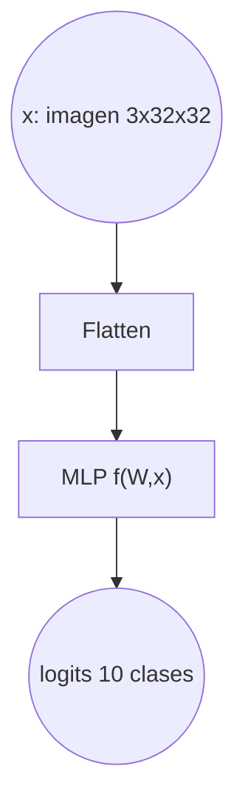
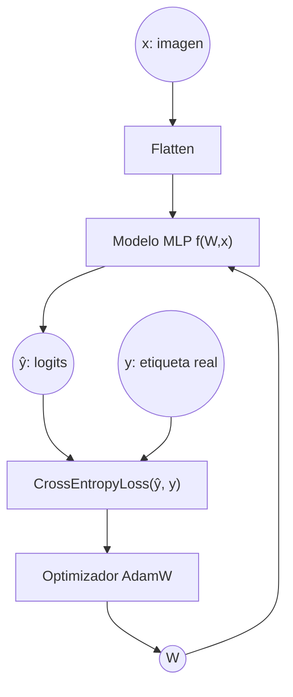
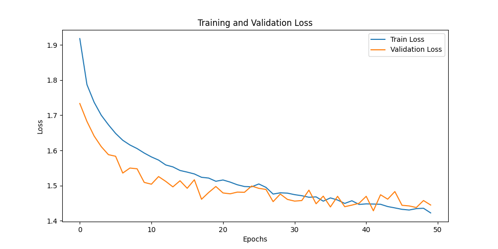
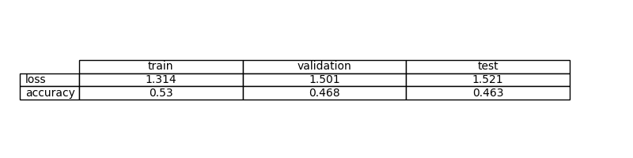
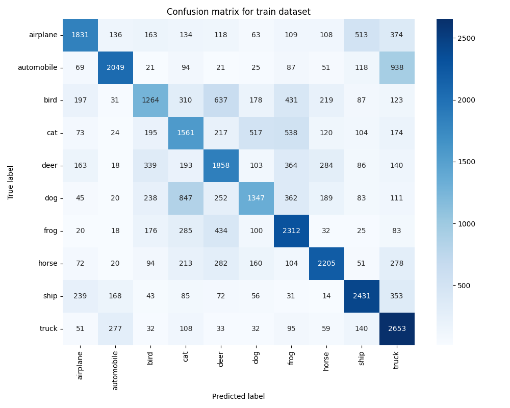
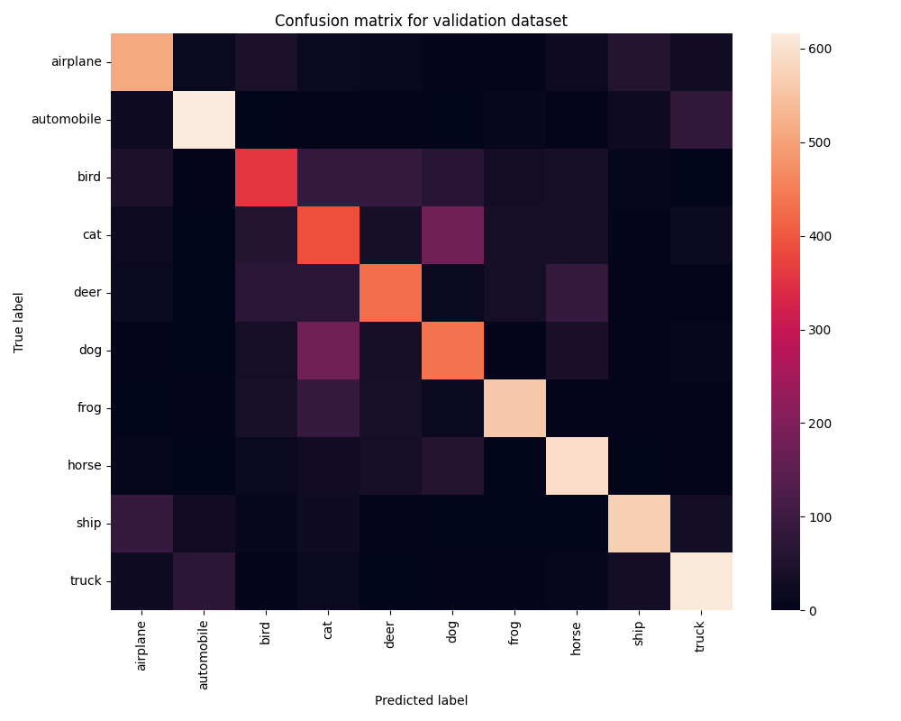
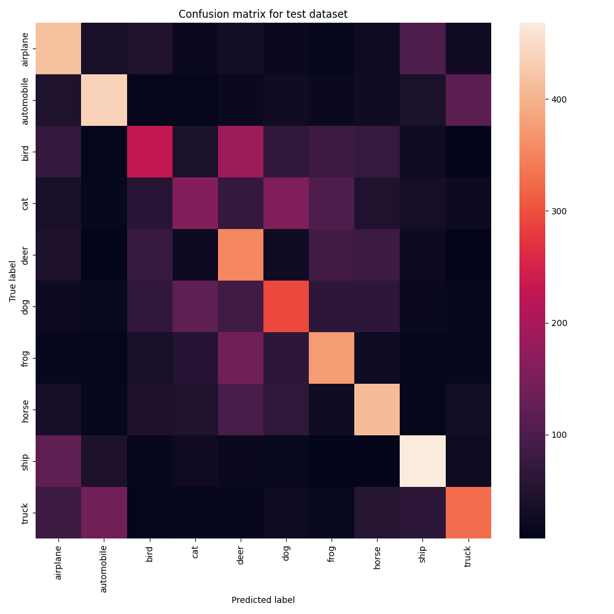

# Ejercicio 5: Crear un Modelo de Aprendizaje Profundo para la clasificación de imágenes en PyTorch con el conjunto de datos CIFAR-10

## Objetivo

Desarrollar un modelo que pueda clasificar imágenes del conjunto de datos CIFAR-10

Primero prueba un modelo solo con capas totalmente conectadas. Crear un archivo evaluate.py que evalúe el modelo y calcule y almacene las métricas de evaluación, incluyendo una matriz de confusión

¿Cuáles son las conclusiones?

El modelo MLP basado únicamente en capas totalmente conectadas consigue aprender patrones básicos del conjunto CIFAR-10 y alcanzar un rendimiento razonable, pero presenta limitaciones claras en capacidad de generalización. Las métricas obtenidas y las matrices de confusión muestran que, aunque clasifica correctamente una parte significativa de las imágenes, comete errores entre clases visualmente similares. Esto se debe principalmente a que al aplanar la imagen se pierde la estructura espacial, lo que hace que este tipo de arquitectura no sea la más adecuada para tareas de clasificación de imágenes.

## Formalización de tareas

La tarea puede formalizarse en dos pasos:

1. Definir el problema de clasificación supervisada.
2. Establecer el enfoque basado en aprendizaje profundo para resolverlo.

Se trata de un problema de clasificación multiclase donde cada imagen debe asignarse a una de las 10 categorías del conjunto CIFAR-10.

### Formalización de tareas (Inferencia)

Existe una función desconocida $f$ que relaciona cada imagen $x$ del conjunto CIFAR-10 con su clase correspondiente.

$$
y = f(x)
$$

El objetivo es aproximar esta función mediante un modelo de aprendizaje automático parametrizado por una matriz de pesos $W$ de manera que:

$$
\hat{y} = f(W,x)
$$	​
​
donde $\hat{y}$ representa el vector de salida del modelo (logits), a partir del cual se obtiene la clase predicha aplicando la operación:

$$
clase \quad predicha = arg \quad max(\hat{y})
$$

Expresado gráficamente:

El vector de entrada, tras el aplanado de la imagen, tiene tamaño:

$$
[bs \times 3072]
$$

donde $bs$ es el batch size, y $3072$ corresponde a $3 \times 32 \times 32$.

La salida del modelo tiene tamaño:

$$
[bs \times 10]
$$

correspondiente a los logits asociados a las 10 clases del conjunto CIFAR-10.

### Formalización de tareas (Entrenamiento)

#### Explicación del diagrama de entrenamiento

El diagrama representa el proceso completo de entrenamiento de un modelo de clasificación multiclase basado en un Perceptrón Multicapa (MLP), entrenado mediante la minimización de la función de pérdida Cross-Entropy.

##### Elementos del diagrama

- x: imagen de entrada del conjunto CIFAR-10 (3x32x32).
- y: etiqueta real asociada a la imagen (valor entero entre 0 y 9).
- Flatten: operación que transforma la imagen en un vector de tamaño 3072.
- f(W, x): modelo MLP parametrizado por los pesos $W$.
- $\hat{y}$ (logits): salida del modelo, vector de tamaño 10 que representa las puntuaciones para cada clase.
- Loss: función de pérdida CrossEntropyLoss que mide la diferencia entre los logits y la clase real.
- $W$: conjunto de parámetros del modelo que se ajustan durante el entrenamiento.
- Optimizador (AdamW): algoritmo utilizado para actualizar los pesos del modelo.

##### Flujo del proceso de aprendizaje

1. La imagen $x$ se introduce en el modelo tras ser aplanada.
2. El modelo $f(W, x)$ genera un vector de logits $\hat{y}$.
3. Los logits $\hat{y}$ se comparan con la etiqueta real y mediante la función de pérdida CrossEntropyLoss.
4. La función de pérdida produce un valor escalar que cuantifica el error del modelo.
5. Este error se utiliza para calcular los gradientes y actualizar los pesos $W$ mediante el optimizador AdamW.
6. Los pesos actualizados se realimentan al modelo, cerrando el ciclo de entrenamiento.

Este proceso se repite de forma iterativa a lo largo de múltiples épocas hasta que la función de pérdida converge o se alcanza el número máximo de épocas definido.

## Métricas de evaluación

Al tratarse de un problema de clasificación multiclase, se utilizan las siguientes métricas:
- Cross-Entropy Loss: mide la diferencia entre los logits generados por el modelo y las etiquetas reales. Es la función de pérdida utilizada durante el entrenamiento y permite cuantificar el grado de ajuste del modelo.
- Accuracy: representa el porcentaje de muestras correctamente clasificadas respecto al total. Es la métrica principal para evaluar el desempeño global del clasificador.
- Matriz de confusión: permite analizar el comportamiento del modelo por clase, mostrando el número de aciertos y errores. Esta métrica resulta especialmente útil para identificar qué categorías se confunden.

## Consideraciones de datos

### Descripción del conjunto de datos

El conjunto de datos está compuesto por 60.000 imágenes en color (RGB) de tamaño 32x32 píxeles, distribuidas en 10 clases diferentes: airplane, automobile, bird, cat, deer, dog, frog, horse, ship y truck.

Cada imagen puede representarse como un tensor de dimensión 3x32x32. En el caso del modelo MLP las imágenes se transforman mediante una operación de flatten, convirtiéndose en vectores de 3072 características.

### Preparación y preprocesamiento de datos

No se ha realizado ningún preprocesado. El conjunto de datos se ha dividido en conjuntos de entrenamiento, validación y prueba.

### Aumento de datos

No se ha realizado ninguna ampliación de datos.

## Consideraciones del modelo

Dado que el problema abordado es una tarea de clasificación multiclase, un modelo lineal simple no sería suficiente para capturar las relaciones complejas presentes en las imágenes del conjunto CIFAR-10. Las imágenes contienen patrones visuales no lineales que requieren una arquitectura capaz de modelar interacciones más complejas entre las características de entrada.

Por este motivo se utiliza un Perceptrón Multicapa (MultiLayerPerceptron) compuesto por varias capas totalmente conectadas con función de activación ReLU. Esta arquitectura introduce no linealidad en el modelo, permitiendo aproximar funciones más complejas que una simple combinación lineal de los píxeles de entrada.

### Funciones de pérdida adecuadas

La función de pérdida utilizada depende del tipo de problema que se esté abordando:
- En problemas de regresión, se emplean métricas como el error cuadrático medio (MSE), ya que la salida es un valor continuo.
- En problemas de clasificación multiclase, como en este ejercicio con CIFAR-10, se utiliza la Cross-Entropy Loss, que mide la discrepancia entre los logits generados por el modelo y la clase real.

### Función de Pérdida Seleccionada

En esta tarea se utiliza la función de pérdida Cross-Entropy Loss ya que el problema es de clasificación multiclase, donde la salida del modelo corresponde a una de las 10 clases posibles del conjunto CIFAR-10.

En la implementación utilizada (CrossEntropyLoss de PyTorch), la función combina internamente la operación softmax con la entropía cruzada, por lo que el modelo devuelve directamente logits sin aplicar ninguna activación en la última capa.

### Posibles arquitecturas

Para problemas de clasificación de imágenes existen distintas arquitecturas posibles:
- Modelo lineal (perceptrón simple): este tipo de modelo realiza únicamente una combinación lineal de las características de entrada. En el caso de imágenes, esto implica que no puede capturar relaciones complejas entre los píxeles ni modelar patrones visuales relevantes. Por tanto, su capacidad de clasificación en un conjunto como CIFAR-10 es muy limitada.
- Perceptrón multicapa (MLP): los modelos con una o más capas ocultas y funciones de activación no lineales permiten modelar relaciones más complejas entre las características de entrada. Un MLP es un aproximador universal y puede aprender fronteras de decisión no lineales, lo que lo hace más adecuado que un modelo puramente lineal.
- Redes neuronales convolucionales (CNN): son arquitecturas específicamente diseñadas para trabajar con datos estructurados espacialmente, como imágenes. Las capas convolucionales permiten extraer características locales y preservar la información espacial, lo que generalmente produce un rendimiento superior en tareas de visión por computador.

Dado que el enunciado del ejercicio restringe el uso a capas totalmente conectadas, la arquitectura seleccionada es un Perceptrón Multicapa (MLP) con capas ocultas y activaciones no lineales. Aunque no es la arquitectura óptima para clasificación de imágenes, permite modelar relaciones no lineales entre los píxeles y sirve como base comparativa para analizar posteriormente las ventajas de modelos más adecuados como las CNN.

### Activación de la última capa

Al tratarse de una tarea de clasificación multiclase, la salida del modelo debe representar las puntuaciones asociadas a cada una de las 10 clases posibles. Por este motivo, no se aplica ninguna función de activación en la última capa del modelo.

La capa final devuelve directamente logits, de este modo, se garantiza una implementación correcta y numéricamente estable del proceso de entrenamiento sin necesidad de aplicar una activación adicional en la salida.

### Otras consideraciones

Se utiliza el optimizador AdamW debido a su estabilidad durante el entrenamiento y a su buena capacidad de convergencia en redes neuronales profundas.

## Entrenamiento

El entrenamiento se ha realizado durante un máximo de 50 épocas, seleccionando el modelo con menor validation loss como mejor configuración.

Durante el proceso se ha monitorizado la evolución de la función de pérdida tanto en el conjunto de entrenamiento como en el de validación, lo que ha permitido analizar el comportamiento del modelo y detectar posibles indicios de sobreajuste.

El gráfico de la función de pérdida se muestra a continuación.

### Hiperparámetros de entrenamiento

La tasa de aprendizaje se establece en 0.001. El entrenamiento se realiza durante 50 épocas, utilizando un batch size de 64.

El modelo emplea un Perceptrón Multicapa con 512 neuronas en cada capa oculta, incorporando funciones de activación ReLU y regularización mediante dropout para reducir el sobreajuste.

La selección de estos hiperparámetros se realizó de forma iterativa, comparando el validation loss obtenido con distintas configuraciones de número de neuronas, épocas y tamaño de batch.

### Grafo de la función de pérdida

### Discusión sobre el proceso de entrenamiento

Durante el entrenamiento se observa una disminución progresiva de la función de pérdida en el conjunto de entrenamiento, mientras que la pérdida de validación también desciende en las primeras épocas y posteriormente tiende a estabilizarse. Esto indica que el modelo aprende patrones relevantes al inicio, pero que la mejora se vuelve más limitada a medida que avanza el entrenamiento.

Las curvas de entrenamiento y validación presentan una ligera separación, lo que sugiere la aparición de un leve sobreajuste. No obstante, la diferencia no es excesiva, y el rendimiento en el conjunto de test resulta coherente con el obtenido en validación, lo que indica una capacidad de generalización razonable.

Se observa que aumentar el número de épocas más allá de 50 no produce mejoras significativas en la pérdida de validación. Por este motivo, se selecciona el modelo correspondiente al menor validation loss obtenido durante el entrenamiento como configuración final.

## Evaluación

### Métricas de evaluación

Las métricas obtenidas para los conjuntos de entrenamiento, validación y test muestran un comportamiento coherente con el proceso de aprendizaje del modelo. La pérdida en entrenamiento es inferior a la de validación y test, lo que indica que el modelo logra ajustarse a los datos vistos durante el entrenamiento. La accuracy obtenida en validación y test es similar, lo que sugiere que el modelo presenta una capacidad de generalización razonable y no memoriza exclusivamente los datos de entrenamiento.

En conjunto, los resultados reflejan que el modelo MLP es capaz de aprender patrones relevantes del conjunto CIFAR-10, aunque su rendimiento está limitado por la arquitectura utilizada, al no aprovechar la estructura espacial de las imágenes.

Las métricas de cada conjunto de datos se representan:

### Evaluación de los resultados

Aquí tenéis ejemplos de resultados de evaluación para conjuntos de entrenamiento, validación y prueba.

Ejemplo para el conjunto de entrenamiento:

Ejemplo para el conjunto de validación:

Ejemplo para el conjunto de pruebas:

### Discusión de los resultados

¿Cómo resuelve el modelo el problema?

El modelo resuelve el problema aprendiendo fronteras de decisión no lineales a partir de los píxeles de entrada. Tras aplanar la imagen, el Perceptrón Multicapa aplica transformaciones lineales seguidas de activaciones ReLU, permitiendo modelar relaciones complejas entre las características. A partir de los logits generados en la última capa, la clase predicha se obtiene seleccionando la puntuación más alta. De este modo, el modelo aprende a discriminar entre las 10 clases del conjunto CIFAR-10 basándose únicamente en combinaciones no lineales de los píxeles.

¿Hay sobreajuste, subajuste o algún otro problema?

Se observa un ligero sobreajuste, ya que la pérdida en entrenamiento es inferior a la de validación y test. Sin embargo, la diferencia no es excesiva y las métricas de validación y test son similares, lo que indica una generalización razonable. No se aprecia un subajuste claro, ya que el modelo consigue reducir la pérdida y alcanzar una accuracy cercana al 50%. El principal límite no proviene del entrenamiento, sino de la arquitectura utilizada, que pierde la estructura espacial de las imágenes al aplanarlas.

¿Cómo podemos mejorar el modelo?

El modelo podría mejorarse aumentando su capacidad (más neuronas o más capas ocultas) o ajustando hiperparámetros como el batch size o la tasa de aprendizaje. Sin embargo, los experimentos realizados muestran que estas mejoras producen incrementos limitados en el rendimiento. Una mejora significativa requeriría utilizar arquitecturas diseñadas específicamente para imágenes, como redes neuronales convolucionales (CNN), que preservan la información espacial.

¿Cómo se generalizará este modelo a nuevos datos?

Dado que las métricas obtenidas en el conjunto de test son similares a las de validación, se espera que el modelo generalice de forma razonable a nuevas imágenes procedentes de la misma distribución que CIFAR-10. No obstante, su capacidad de generalización está condicionada por las limitaciones estructurales del MLP, por lo que su rendimiento seguirá siendo inferior al de arquitecturas más adecuadas para visión por computador.

## Diseño de bucles de retroalimentación

El proceso de mejora del modelo se realizó de forma iterativa. En una primera fase se empleó una arquitectura con dos capas ocultas y un número reducido de neuronas, observando que el modelo era capaz de aprender parcialmente el problema, aunque con un rendimiento limitado.

Posteriormente, se incrementó el número de neuronas en las capas ocultas. Este cambio permitió reducir progresivamente el validation loss, indicando que el modelo necesitaba mayor capacidad para representar las relaciones no lineales presentes en los datos.

También se experimentó con el número de épocas y el tamaño del batch. Se observó que aumentar excesivamente el número de épocas no producía mejoras significativas y podía favorecer el sobreajuste. El incremento del batch size a 64 permitió un entrenamiento más estable y eficiente computacionalmente.

Finalmente, la introducción de dropout contribuyó a reducir ligeramente el validation loss, ayudando a controlar el sobreajuste cuando se incrementó el número de neuronas.

El mejor resultado se obtuvo con 512 neuronas, 50 épocas y batch size 64.

| Neuronas | Épocas | Batch size | Dropout | Best val loss |
| -------- | ------ | ---------- | ------- | ------------- |
| 64       | 100    | 10         | No      | 1.5594        |
| 64       | 300    | 10         | No      | 1.5269        |
| 128      | 200    | 10         | No      | 1.5015        |
| 128      | 200    | 64         | No      | 1.4167        |
| 256      | 40     | 64         | No      | 1.4521        |
| 256      | 50     | 64         | Sí      | 1.4515        |
| 512      | 50     | 64         | Sí      | 1.4335        |

## Preguntas

### ¿Cuáles son las diferencias que encontraste entre el modelo anterior y este?

La principal diferencia entre el modelo anterior y el actual radica en la naturaleza del problema abordado. En el ejercicio anterior se trataba de una tarea de regresión no lineal, mientras que en este caso se aborda un problema de clasificación multiclase con imágenes como entrada. Esto implica diferencias tanto en la función de pérdida (MSE frente a CrossEntropyLoss) como en las métricas de evaluación utilizadas.

En este ejercicio, el modelo debe asignar cada imagen a una de diez clases posibles, lo que requiere aprender fronteras de decisión no lineales en un espacio de alta dimensionalidad (3072 características tras el flatten). Además, el uso de logits en la última capa y la aplicación interna de softmax en la función de pérdida representan una diferencia importante respecto al modelo de regresión anterior.

Por otro lado, la complejidad del problema es significativamente mayor, ya que el modelo debe discriminar entre patrones visuales complejos. Esto pone de manifiesto las limitaciones del MLP cuando se aplica a imágenes.

### ¿El modelo se generaliza bien a datos nuevos?

El modelo presenta una capacidad de generalización razonable, aunque no perfecta. Esto se observa en la similitud entre las métricas obtenidas en los conjuntos de validación y test, lo que indica que el modelo mantiene un rendimiento estable sobre datos no vistos durante el entrenamiento.

No obstante, existe una ligera diferencia entre las métricas de entrenamiento y validación, lo que sugiere la presencia de un leve sobreajuste. Aun así, esta diferencia no es excesiva y el comportamiento del modelo en el conjunto de test confirma que ha aprendido patrones generales del problema y no únicamente los datos de entrenamiento.

La limitación principal en la generalización no proviene tanto del proceso de entrenamiento como de la arquitectura utilizada, ya que el MLP pierde la estructura espacial de las imágenes al aplanarlas, lo que restringe su capacidad para capturar patrones visuales más complejos.