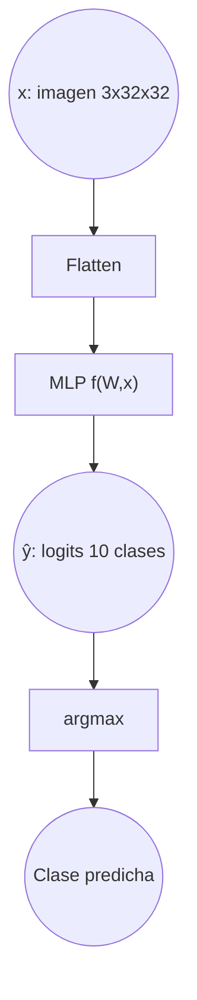
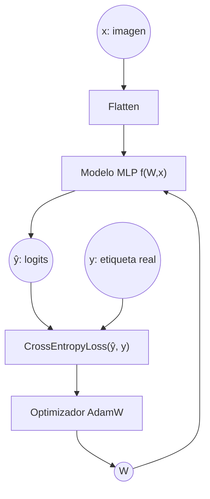

# Ejercicio 5: Crear un Modelo de Aprendizaje Profundo para la clasificación de imágenes en PyTorch con el conjunto de datos CIFAR-10

## Objetivo

Desarrollar un modelo que pueda clasificar imágenes del conjunto de datos CIFAR-10

Primero prueba un modelo solo con capas totalmente conectadas. Crear un archivo evaluate.py que evalúe el modelo y calcule y almacene las métricas de evaluación, incluyendo una matriz de confusión

¿Cuáles son las conclusiones?

El modelo MLP basado únicamente en capas totalmente conectadas consigue aprender patrones básicos del conjunto CIFAR-10 y alcanzar un rendimiento razonable, pero presenta limitaciones claras en capacidad de generalización. Las métricas obtenidas y las matrices de confusión muestran que, aunque clasifica correctamente una parte significativa de las imágenes, comete errores frecuentes entre clases visualmente similares. Esto se debe principalmente a que al aplanar la imagen se pierde la estructura espacial, lo que hace que este tipo de arquitectura no sea la más adecuada para tareas de clasificación de imágenes complejas.

## Formalización de tareas

La tarea puede formalizarse en dos pasos. Primero, definimos claramente el objetivo que se desea alcanzar. En este caso, se trata de un problema de clasificación multiclase supervisada, donde el objetivo es asignar correctamente cada imagen del conjunto CIFAR-10 a una de sus diez clases posibles. Cada muestra de entrada corresponde a una imagen RGB de 32×32 píxeles, que se transforma en un vector de características al utilizar un modelo basado únicamente en capas totalmente conectadas.

En segundo lugar, definimos el enfoque adoptado para resolver el problema. Se ha utilizado un modelo MLP (Multi-Layer Perceptron) compuesto exclusivamente por capas fully-connected, entrenado mediante la minimización de la función de pérdida Cross-Entropy utilizando el optimizador AdamW. El rendimiento del modelo se evalúa mediante métricas como la pérdida y la accuracy en los conjuntos de entrenamiento, validación y test, complementándose con el análisis de la matriz de confusión para estudiar el comportamiento por clase.

### Formalización de tareas (Inferencia)

Existe una función desconocida $f$ que relaciona cada imagen $x$ del conjunto CIFAR-10 con su clase correspondiente.

$$
y = f(x)
$$

Nuestro objetivo es aproximar esta función mediante un modelo de aprendizaje automático parametrizado por una matriz de pesos $W$ de manera que:

$$
\hat{y} = f(W,x)
$$	​
​
donde \hat{y} representa el vector de salida del modelo (logits), a partir del cual se obtiene la clase predicha aplicando la operación:

$$
clase predicha = arg max(\hat{y})
$$

Expresado gráficamente:

El vector de entrada, tras el aplanado de la imagen, tiene tamaño: [bs×3072]

donde $bs$ es el batch size, y 3072 corresponde a $3x32x32$

La salida del modelo tiene tamaño: [bs×10], correspondiente a los logits asociados a las 10 clases del conjunto CIFAR-10.

### Formalización de tareas (Entrenamiento)

#### Explicación del diagrama de entrenamiento

El diagrama representa el proceso completo de entrenamiento de un modelo de clasificación multiclase basado en un Perceptrón Multicapa (MLP), entrenado mediante la minimización de la función de pérdida Cross-Entropy.

##### Elementos del diagrama

- x: imagen de entrada del conjunto CIFAR-10 (3×32×32).
- y: etiqueta real asociada a la imagen (valor entero entre 0 y 9).
- Flatten: operación que transforma la imagen en un vector de tamaño 3072.
- f(W, x): modelo MLP parametrizado por los pesos W.
- \hat{y} (logits): salida del modelo, vector de tamaño 10 que representa las puntuaciones para cada clase.
- Loss: función de pérdida CrossEntropyLoss que mide la diferencia entre los logits y la clase real.
- W: conjunto de parámetros del modelo que se ajustan durante el entrenamiento.
- Optimizador (AdamW): algoritmo utilizado para actualizar los pesos del modelo.

##### Flujo del proceso de aprendizaje

1. La imagen x se introduce en el modelo tras ser aplanada.
2. El modelo f(W, x) genera un vector de logits ŷ.
3. Los logits ŷ se comparan con la etiqueta real y mediante la función de pérdida CrossEntropyLoss(ŷ, y).
4. La función de pérdida produce un valor escalar que cuantifica el error del modelo.
5. Este error se utiliza para calcular los gradientes y actualizar los pesos W mediante el optimizador AdamW.
6. Los pesos actualizados se realimentan al modelo, cerrando el ciclo de entrenamiento.

Este proceso se repite de forma iterativa a lo largo de múltiples épocas hasta que la función de pérdida converge o se alcanza el número máximo de épocas definido.

## Métricas de evaluación

En este ejercicio estamos abordando un problema de clasificación multiclase, por lo que las métricas utilizadas difieren de las empleadas en problemas de regresión.

Para evaluar el rendimiento del modelo se han utilizado las siguientes métricas:

- Cross-Entropy Loss: mide la diferencia entre los logits generados por el modelo y las etiquetas reales. Es la función de pérdida utilizada durante el entrenamiento y permite cuantificar el grado de ajuste del modelo.

- Accuracy: representa el porcentaje de muestras correctamente clasificadas respecto al total. Es la métrica principal para evaluar el desempeño global del clasificador.

- Matriz de confusión: permite analizar el comportamiento del modelo por clase, mostrando el número de aciertos y errores entre cada par de clases. Esta métrica resulta especialmente útil para identificar qué categorías se confunden con mayor frecuencia.

Estas métricas se han calculado para los conjuntos de entrenamiento, validación y test, permitiendo evaluar tanto la capacidad de aprendizaje del modelo como su capacidad de generalización.

## Consideraciones de datos

### Descripción del conjunto de datos

El conjunto de datos está compuesto por 60.000 imágenes en color (RGB) de tamaño 32×32 píxeles, distribuidas en 10 clases diferentes: airplane, automobile, bird, cat, deer, dog, frog, horse, ship y truck.

Cada imagen puede representarse como un tensor de dimensión 3×32×32, correspondiente a los tres canales de color (rojo, verde y azul). En el caso del modelo MLP utilizado en este ejercicio, las imágenes se transforman mediante una operación de flatten, convirtiéndose en vectores de 3072 características.

El conjunto se divide en:
- Datos de entrenamiento
- Datos de validación
- Datos de test

Lo que permite evaluar tanto la capacidad de aprendizaje del modelo como su capacidad de generalización ante datos no vistos durante el entrenamiento.

### Preparación y preprocesamiento de datos

No se ha realizado ningún preprocesado. El conjunto de datos se ha dividido en conjuntos de entrenamiento, validación y prueba.

### Aumento de datos

No se ha realizado ninguna ampliación de datos.

## Consideraciones del modelo

Dado que el problema abordado es una tarea de clasificación multiclase, un modelo lineal simple no sería suficiente para capturar las relaciones complejas presentes en las imágenes del conjunto CIFAR-10. Las imágenes contienen patrones visuales no lineales que requieren una arquitectura capaz de modelar interacciones más complejas entre las características de entrada.

Por este motivo se utiliza un Perceptrón Multicapa (MultiLayerPerceptron) compuesto por varias capas totalmente conectadas con función de activación ReLU. Esta arquitectura introduce no linealidad en el modelo, permitiendo aproximar funciones más complejas que una simple combinación lineal de los píxeles de entrada.

La imagen de entrada (3×32×32) se transforma previamente en un vector de 3072 características mediante una operación de flatten. La salida del modelo consiste en un vector de 10 logits, uno por cada clase del conjunto CIFAR-10. No se aplica función de activación en la última capa, ya que se utiliza CrossEntropyLoss, que incorpora internamente la operación softmax necesaria para problemas de clasificación multiclase.

### Funciones de pérdida adecuadas

La función de pérdida utilizada depende del tipo de problema que se esté abordando:

En problemas de regresión, se emplean métricas como el error cuadrático medio (MSE), ya que la salida es un valor continuo.

En problemas de clasificación multiclase, como en este ejercicio con CIFAR-10, se utiliza la Cross-Entropy Loss, que mide la discrepancia entre los logits generados por el modelo y la clase real.

En este caso, se ha utilizado CrossEntropyLoss, ya que el objetivo es predecir correctamente una de las 10 clases posibles. Esta función combina internamente una operación softmax con la entropía cruzada, lo que la hace adecuada para tareas de clasificación multiclase.

### Función de Pérdida Seleccionada

En esta tarea se utiliza la función de pérdida Cross-Entropy Loss, ya que el problema planteado es un problema de clasificación multiclase, donde la salida del modelo corresponde a una de las 10 clases posibles del conjunto CIFAR-10.

La función Cross-Entropy mide la discrepancia entre los logits generados por el modelo y la etiqueta real, penalizando especialmente las predicciones incorrectas con alta confianza. Su expresión matemática puede escribirse como:

$$ 
CE = - \sum{y_i log(\hat{p_i})}
$$

donde:

C es el número de clases,
y_i es la etiqueta real codificada en formato one-hot,
\hat{p_i} es la probabilidad predicha para la clase 

En la implementación utilizada (CrossEntropyLoss de PyTorch), la función combina internamente la operación softmax con la entropía cruzada, por lo que el modelo devuelve directamente logits sin aplicar ninguna activación en la última capa.

El objetivo del entrenamiento es ajustar los pesos sinápticos del modelo para minimizar esta función de pérdida mediante el optimizador AdamW, utilizando un algoritmo basado en gradiente descendente.

### Posibles arquitecturas

Para problemas de clasificación de imágenes existen distintas arquitecturas posibles:

Modelo lineal (perceptrón simple): este tipo de modelo realiza únicamente una combinación lineal de las características de entrada. En el caso de imágenes, esto implica que no puede capturar relaciones complejas entre los píxeles ni modelar patrones visuales relevantes. Por tanto, su capacidad de clasificación en un conjunto como CIFAR-10 es muy limitada.

Perceptrón multicapa (MLP): los modelos con una o más capas ocultas y funciones de activación no lineales permiten modelar relaciones más complejas entre las características de entrada. Un MLP es un aproximador universal y puede aprender fronteras de decisión no lineales, lo que lo hace más adecuado que un modelo puramente lineal.

Redes neuronales convolucionales (CNN): son arquitecturas específicamente diseñadas para trabajar con datos estructurados espacialmente, como imágenes. Las capas convolucionales permiten extraer características locales y preservar la información espacial, lo que generalmente produce un rendimiento superior en tareas de visión por computador.

Dado que el enunciado del ejercicio restringe el uso a capas totalmente conectadas, la arquitectura seleccionada es un Perceptrón Multicapa (MLP) con capas ocultas y activaciones no lineales. Aunque no es la arquitectura óptima para clasificación de imágenes, permite modelar relaciones no lineales entre los píxeles y sirve como base comparativa para analizar posteriormente las ventajas de modelos más adecuados como las CNN.

### Activación de la última capa

Escribe tu respuesta aquí.

### Otras consideraciones

Escribe tu respuesta aquí.

## Entrenamiento

Escribe tu respuesta aquí.

### Hiperparámetros de entrenamiento

Escribe tu respuesta aquí.

### Grafo de la función de pérdida

### Discusión sobre el proceso de entrenamiento

Escribe tu respuesta aquí.

## Evaluación

### Métricas de evaluacións

Escribe tu respuesta aquí. [VER SI HAY MÁS FORMAS DE VER ESTO GRÁFICAMENTE]

Las métricas de cada conjunto de datos se representan:

### Evaluación de los resultados

Aquí tenéis ejemplos de resultados de evaluación para conjuntos de entrenamiento, validación y prueba.

Ejemplo para el conjunto de entrenamiento:

Ejemplo para el conjunto de validación:

Ejemplo para el conjunto de pruebas:

### Discusión de los resultados

¿Cómo resuelve el modelo el problema?
¿Hay sobreajuste, subajuste o algún otro problema? 
¿Cómo podemos mejorar el modelo?
¿Cómo se generalizará este modelo a nuevos datos?

## Diseño de bucles de retroalimentación

Describe el proceso que has seguido para mejorar el modelo y la evolución del rendimiento del modelo durante el proceso.

Puedes incluir una tabla que indique los chanched parameters y los resultados obtenidos tras el proceso.

## Preguntas

Por favor, responde a las siguientes preguntas. Incluye gráficos si es necesario. Almacenar los gráficos en la carpeta `outs/exercise_05`.

### ¿Cuáles son las diferencias que encontraste entre el modelo anterior y este?

### ¿El modelo se generaliza bien a datos nuevos?